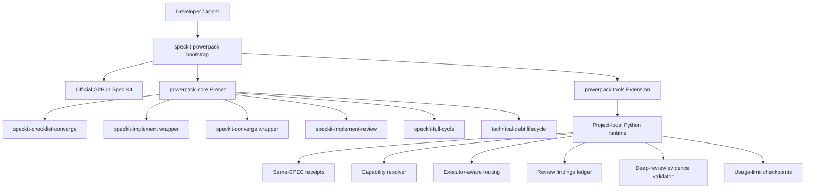
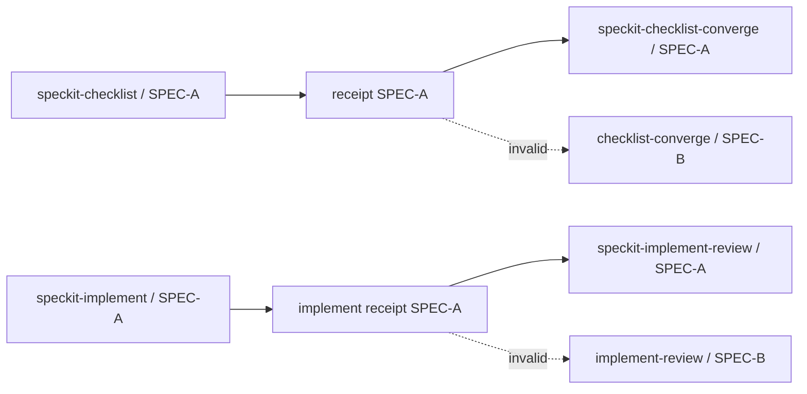
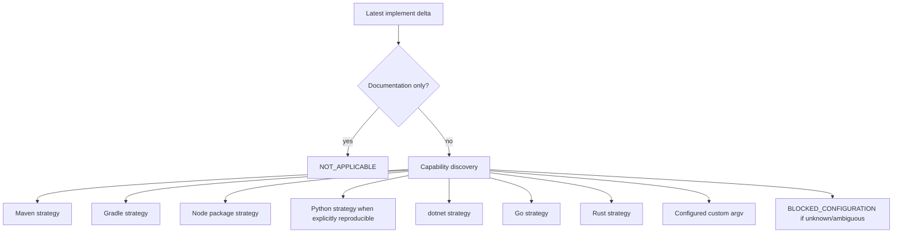
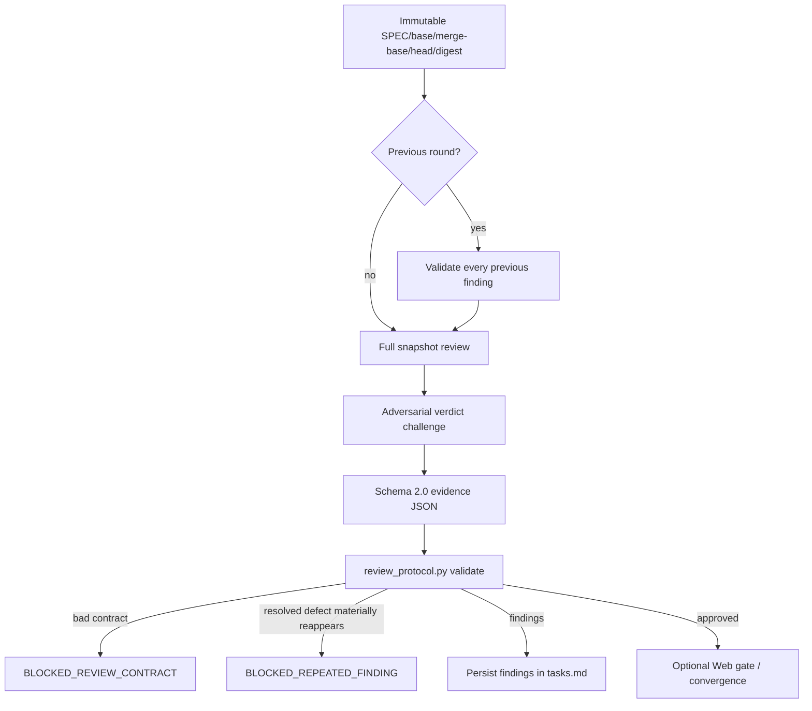
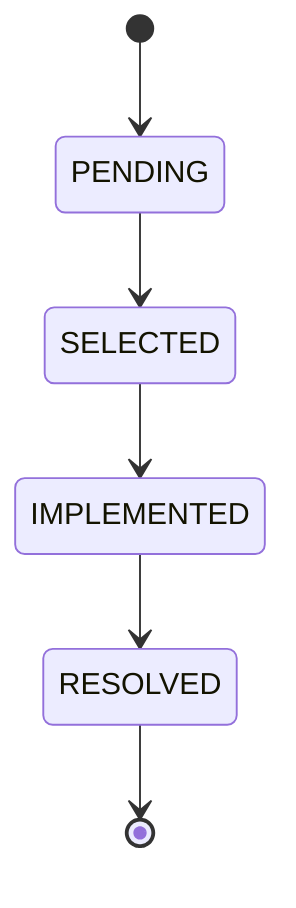
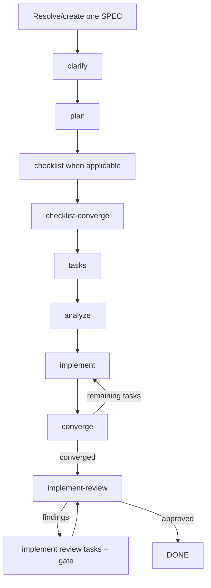
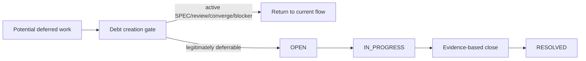
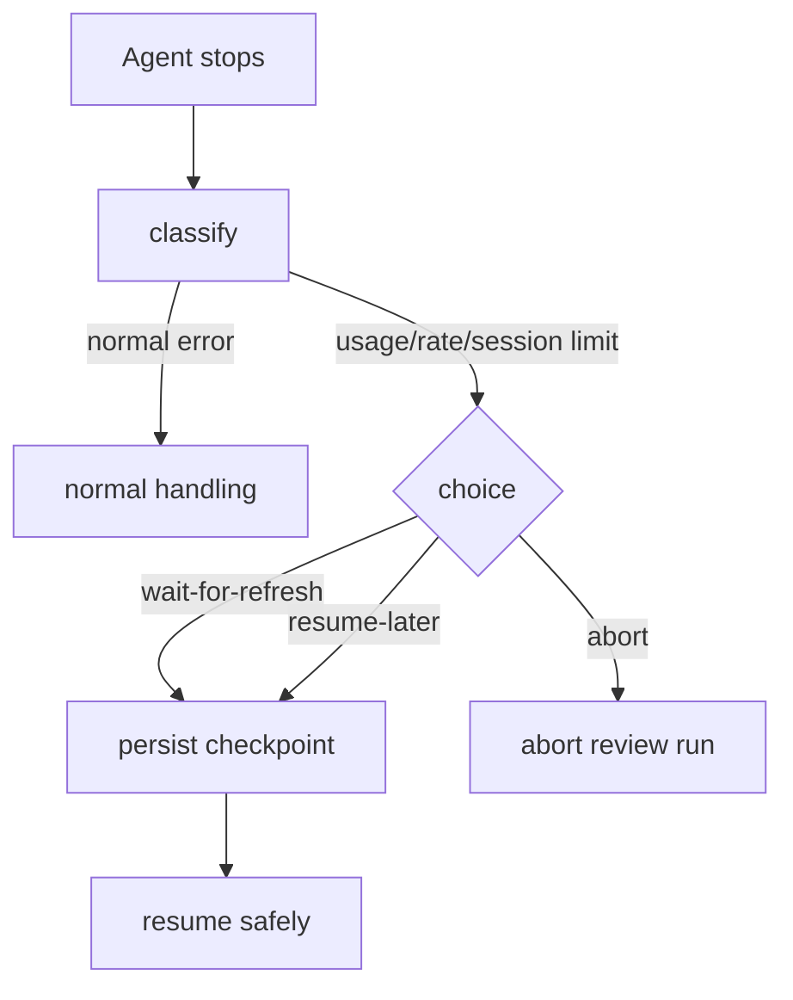

# SpecKit PowerPack

> **Status: Draft / pre-release.** The repository is intentionally evolving before its first stable public release.

SpecKit PowerPack is a composable enhancement layer for the official [GitHub Spec Kit](https://github.com/github/spec-kit). It does **not** fork or replace Spec Kit. It bootstraps/uses the official `specify` CLI, installs PowerPack components through Spec Kit-native presets/extensions, and adds stricter workflow state, convergence, deep implementation review, full-cycle orchestration and technical-debt governance.

## What this draft adds

- `speckit-checklist-converge` — requirements/checklist convergence after the checklist step actually ran for the same SPEC.
- `speckit-implement` wrapper — precise before/after implementation delta and same-SPEC receipts.
- `speckit-converge` wrapper — convergence state integrated with the PowerPack lifecycle.
- `speckit-implement-review` — independent deep technical review after implementation.
- **Deep Review Evidence Protocol** — immutable snapshot identity, requirement coverage, baseline comparison, previous-finding validation, full-snapshot re-review and adversarial verdict challenge.
- Review JSON validator with `BLOCKED_REVIEW_CONTRACT` and `BLOCKED_REPEATED_FINDING` classifications.
- Review findings persisted into the current SPEC's `tasks.md` with `PENDING → SELECTED → IMPLEMENTED → RESOLVED` lifecycle.
- `speckit-full-cycle` — same-SPEC orchestration from specification phases through implement/converge/review loops.
- Technical-debt lifecycle: `speckit-debt-create`, `list`, `consult`, `start`, `close`.
- Technical-debt safety floor that forbids using debt as an escape hatch for active SPEC work, convergence gaps, review findings or blockers.
- Architecture/OS/language/framework-agnostic quality-gate capability resolution.
- Claude Code / Codex executor-aware reviewer routing with no recursive Codex spawning.
- Optional ChatGPT Project Web second gate with **platform-scoped browser profiles and project bindings**.
- Usage/session-limit checkpoints, resumable execution and safe review abort.
- CI across Ubuntu, Windows and macOS.

## Core design rule

PowerPack workflow logic must not scatter assumptions about operating system, language, framework, IDE or build tool.

```text
DISCOVER CAPABILITY
        ↓
SELECT STRATEGY
        ↓
EXECUTE CONTRACT
```

Project-specific rules should complement PowerPack through project configuration, policies, gates and local skills rather than cloning PowerPack skills.

## Architecture



PowerPack deliberately avoids treating generated `.claude/skills/*` or `.agents/skills/*` files as its durable source of truth. Spec Kit materializes agent-facing commands from installed presets/extensions.

## Why no Spec Kit fork?

A fork would require continuously merging upstream changes. PowerPack instead composes/wraps official commands where needed and adds reusable policy/runtime layers around them.


## Requirements

Current draft:

- Python 3.11+
- Git
- `uv` when PowerPack must bootstrap official Spec Kit
- Claude Code and/or Codex CLI
- Playwright only for the optional ChatGPT Project Web gate

Independent-review routing:

| Executor | Reviewer | Recursive Codex spawn |
|---|---|---|
| Claude Code | exactly one external `codex exec` | forbidden |
| Codex | current Codex session | forbidden |
| unknown/other | `BLOCKED` | not attempted |

Current deep Codex reviewer profile: `gpt-5.6-sol / xhigh / read-only`.

## Installation

During the draft phase:

```bash
uv tool install speckit-powerpack \
  --from git+https://github.com/ds1david/speckit-powerpack.git
```

New project with Claude Code:

```bash
mkdir my-project
cd my-project
speckit-powerpack init . --integration claude
```

Or Codex:

```bash
speckit-powerpack init . --integration codex
```

Existing Spec Kit project:

```bash
speckit-powerpack install . --integration claude
```

If `specify` is missing and PowerPack should install it:

```bash
speckit-powerpack install . --integration claude --bootstrap-speckit
```

Diagnose installation:

```bash
speckit-powerpack doctor
```

## Installed project configuration

```text
.specify/
└── powerpack/
    ├── bin/
    │   ├── powerpack.py
    │   ├── capabilities.py
    │   └── review_protocol.py
    ├── model-routing.json
    ├── prerequisites.json
    ├── quality-gates.json
    ├── review.json
    ├── full-cycle.json
    ├── technical-debt.json
    ├── deep-review-protocol.md
    ├── technical-debt-policy.md
    ├── state/
    │   └── <spec>.json
    └── runtime/                 # gitignored ephemeral state
        ├── reviews/
        └── limit-checkpoint.json
```

See [`docs/CUSTOMIZATION.md`](docs/CUSTOMIZATION.md) for each skill/configuration surface and [`docs/PROCESS_ARCHITECTURE.md`](docs/PROCESS_ARCHITECTURE.md) for a detailed process diagram mapping every phase to its source/runtime file.

## Same-SPEC predecessor enforcement

PowerPack does not accept "a file exists" as proof that a workflow predecessor ran.



## Precise implementation delta

The implement wrapper captures workspace content before and after the official implementation step. A file that was already dirty before the round is not attributed to that round unless its content changes again during implementation.

The delta is also used to determine whether executable validation is applicable.

## Capability-driven quality gates

No universal Maven command is embedded in the review skill.



Project override:

```json
{
  "schema_version": 1,
  "policy": "capability-strategy",
  "custom_command": ["make", "verify"],
  "unknown_architecture": "block",
  "ambiguous_architecture": "block"
}
```

in `.specify/powerpack/quality-gates.json`.

## `speckit-implement-review`

There is one canonical skill/command asset: `speckit.implement-review.md`.

A temporary `speckit.implement-review-v2.md` existed during the portability/refactoring work. It was a migration artifact, not a second intended skill, and has been removed. The preset now points only to the canonical file.

Responsibilities remain separated:

- `speckit-checklist-converge` → requirements/checklist quality;
- `speckit-converge` → implementation completeness against SPEC/plan/tasks;
- `speckit-implement-review` → independent technical quality and regression evidence.

### Deep-review round



Mandatory review fronts:

- SPEC compliance;
- behavioral regression against baseline;
- architecture/contracts;
- state/concurrency/failures;
- persistence/determinism/idempotency;
- tests/composition root;
- documentation/operability;
- security/scope.

`APPROVED` requires the evidence validator to accept the review. Green tests or an empty-looking diff are not sufficient evidence by themselves.

See [`docs/IMPLEMENT_REVIEW.md`](docs/IMPLEMENT_REVIEW.md).

## Findings are durable work

Every valid finding is persisted before implementation.



Findings cannot be moved to backlog, TODO or technical debt merely to make implementation-review converge.

## `speckit-full-cycle`

`full-cycle` orchestrates existing primitives for exactly one SPEC rather than reimplementing them.



Configure the orchestration in `.specify/powerpack/full-cycle.json`, including interactive/auto mode and round limits. Safety fields such as same-SPEC-only, stop-on-blocked and no debt escape hatch cannot be weakened.

See [`docs/FULL_CYCLE.md`](docs/FULL_CYCLE.md).

## Technical-debt governance

PowerPack adds:

```text
speckit-debt-create
speckit-debt-list
speckit-debt-consult
speckit-debt-start
speckit-debt-close
```

The safety floor is installed at `.specify/powerpack/technical-debt-policy.md`. Project-specific governance is referenced through `.specify/powerpack/technical-debt.json -> project_policy_paths`.



The PowerPack floor is a minimum: project policy may be stricter but may not make active review findings, convergence gaps or blockers deferrable.

See [`docs/TECHNICAL_DEBT.md`](docs/TECHNICAL_DEBT.md).

## Optional ChatGPT Project gate

Codex is the first independent reviewer. When configured, ChatGPT Project Web review is a second independent gate on the **same HEAD** using the same deep-review evidence contract.

Install browser support only when needed:

```bash
speckit-powerpack review setup --install-browser
```

Login to a machine/platform-local persistent profile:

```bash
speckit-powerpack review auth login work
```

Bind a project on the current platform:

```bash
speckit-powerpack review project bind \
  atsel \
  'https://chatgpt.com/g/g-p-.../project' \
  --profile work
```

Use it in the current repository:

```bash
speckit-powerpack review project use atsel
```

Inspect bindings:

```bash
speckit-powerpack review project list --all-platforms
```

Logout/forget current-platform profile state:

```bash
speckit-powerpack review auth logout work
speckit-powerpack review auth forget work
```

Credentials and MFA are entered only in the browser.

### Platform-scoped browser identity

Profiles are isolated by platform even when their human-readable name is identical:

```text
<PowerPack global config root>/
├── config.json
└── browser-profiles/
    ├── windows/
    │   └── work/
    ├── linux/
    │   └── work/
    └── macos/
        └── work/
```

WSL uses the Linux namespace and therefore does not reuse Windows browser storage/authentication. Project aliases also have separate bindings per platform, allowing different ChatGPT accounts/projects when necessary.

## Session/usage limits

Long Claude/Codex loops may hit usage limits. PowerPack distinguishes those from code/test failures and persists a resumable checkpoint when the operator chooses to wait or resume later.



Checkpoints never contain passwords, cookies, MFA values or raw authentication material.

## Abort semantics

`review abort` removes ephemeral review-run state while preserving:

- durable findings already written to `tasks.md`;
- implementation changes;
- platform-scoped browser authentication profiles;
- ChatGPT Project bindings.

## Customization and process documentation

- [`docs/CUSTOMIZATION.md`](docs/CUSTOMIZATION.md) — exactly how each PowerPack skill can be customized and which invariants cannot be weakened.
- [`docs/PROCESS_ARCHITECTURE.md`](docs/PROCESS_ARCHITECTURE.md) — detailed end-to-end diagrams, installed/project/package layers, and a table mapping every process node to its file/configuration.
- [`docs/PORTABILITY.md`](docs/PORTABILITY.md) — platform/capability design.
- [`docs/IMPLEMENT_REVIEW.md`](docs/IMPLEMENT_REVIEW.md) — deep implementation-review contract.
- [`docs/TECHNICAL_DEBT.md`](docs/TECHNICAL_DEBT.md) — debt governance.
- [`docs/FULL_CYCLE.md`](docs/FULL_CYCLE.md) — full-cycle orchestration.

## Security boundaries

- Codex review uses read-only sandbox semantics.
- Passwords/MFA are never collected by the PowerPack CLI.
- Browser profiles live outside source repositories and are separated by platform.
- Ephemeral review state is gitignored.
- Review workflows do not authorize merge, GitHub approval, ready-for-review, force-push or destructive reset.
- Review abort never deletes durable findings.
- Technical debt cannot hide current-flow blockers or findings.

## Development

```bash
python -m pip install -e '.[dev]'
pytest -q
```

CI executes tests and wheel builds on Ubuntu, Windows and macOS with Python 3.11 and 3.13.

## Draft roadmap

Before a stable release, PowerPack is expected to add catalog/release assets for fully catalog-driven Spec Kit Bundle installation, broader integration adapters, additional generic workflows and further hardening based on reusable patterns discovered in real projects.

## License

MIT. See [LICENSE](LICENSE).
