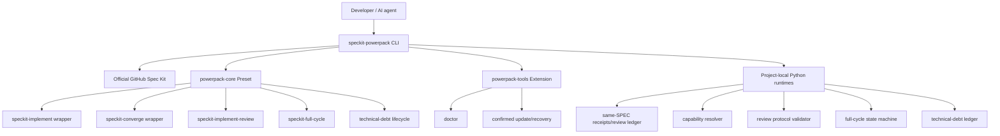
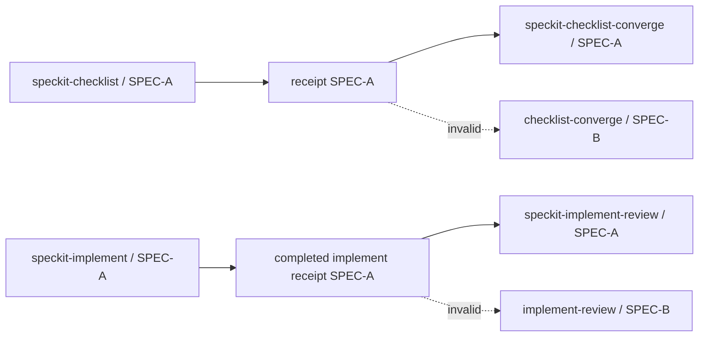
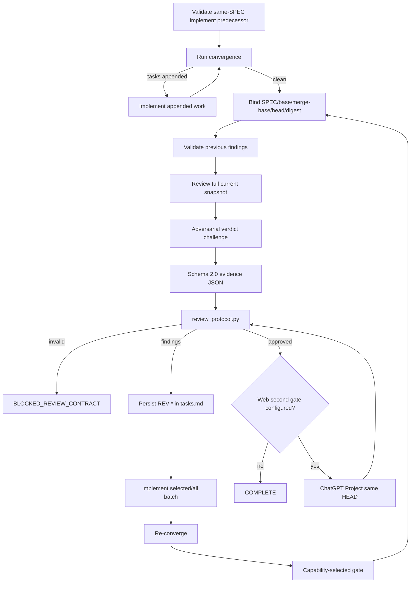
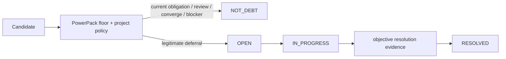

# SpecKit PowerPack

> **Status: Draft / pre-release.** The repository is intentionally evolving before its first stable public release.

SpecKit PowerPack is a composable enhancement layer for the official [GitHub Spec Kit](https://github.com/github/spec-kit). It does **not** fork or replace Spec Kit. It uses Spec Kit-native presets/extensions and adds reusable workflow state, convergence, deep implementation review, full-cycle orchestration, technical-debt governance, executor-aware model routing and managed updates.

## Current happy path

PowerPack preserves the first implementation as an explicit mandatory stage:

```text
speckit-specify
  -> speckit-clarify
  -> speckit-plan
  -> speckit-checklist
  -> speckit-checklist-converge
  -> speckit-tasks
  -> speckit-analyze
  -> speckit-implement
  -> speckit-implement-review
       -> speckit-converge
            -> tasks appended? speckit-implement -> speckit-converge ...
       -> independent review
            -> findings? implement fixes -> speckit-converge -> review ...
            -> approved? COMPLETE
            -> review budget exhausted? BLOCKED_BUDGET -> explicit extend
```

`speckit-implement-review` cannot be used to skip the initial `speckit-implement`. Its first productive action after validating the same-SPEC implementation predecessor is convergence.

## What this draft adds

- `speckit-checklist-converge` with same-SPEC predecessor enforcement.
- `speckit-implement` wrapper with precise before/after workspace delta receipts.
- explicit `speckit-implement -> speckit-implement-review` predecessor contract.
- `speckit-converge` integration with PowerPack state.
- one canonical `speckit-implement-review` that owns convergence/review/fix/re-convergence after the initial implementation.
- Deep Review Evidence Protocol: immutable snapshot identity, requirements/baseline coverage, previous-finding validation, full-snapshot re-review and adversarial verdict challenge.
- review schema 2.0 validator with `BLOCKED_REVIEW_CONTRACT` and `BLOCKED_REPEATED_FINDING`.
- durable review findings in `tasks.md`: `PENDING → SELECTED → IMPLEMENTED → RESOLVED`.
- explicit review budget handling with `BLOCKED_BUDGET` and user-authorized `extend N`.
- `speckit-full-cycle` with a resumable same-SPEC top-level state machine ending in the integrated implementation-review stage.
- governed technical-debt lifecycle: `speckit-debt-create`, `list`, `consult`, `start`, `close` plus a deterministic project-local ledger runtime.
- debt safety floor forbidding active SPEC work, convergence gaps, review findings and blockers from becoming deferred debt.
- architecture/OS/language/framework/build-tool agnostic capability resolution.
- Claude Code / Codex executor-aware reviewer routing without recursive Codex CLI spawning.
- Codex-first model routing: Terra parent, Luna bounded worker, Sol semantic gate/advisor/reviewer.
- optional ChatGPT Project Web second gate with platform-scoped browser profiles and project bindings.
- confirmed self/project update management plus explicit forced recovery.
- usage/session-limit checkpoints and resumable execution.
- cross-platform CI for non-draft PRs and `main`.

## Core design rule

Workflow logic must not scatter assumptions about operating system, language, framework, IDE or build tool:

```text
DISCOVER CAPABILITY
        ↓
SELECT STRATEGY
        ↓
EXECUTE CONTRACT
```

Project-specific rules complement PowerPack through configuration, policy, closure gates and local skills rather than cloning PowerPack skills.

## Architecture



Generated `.claude/skills/*` and `.agents/skills/*` files are materialized views, not the durable customization source.

## Requirements

- Python 3.11+
- Git
- `uv` when PowerPack must bootstrap Spec Kit or self-update
- Claude Code and/or Codex CLI
- Playwright only for the optional ChatGPT Project Web gate

Claude Code is **not required** for a Codex-first PowerPack execution.

## Model routing

### Codex-first defaults

When `.specify/powerpack/model-routing.json` has `active_integration: "codex"`:

| Role | Model | Effort | Authority |
|---|---|---:|---|
| Parent / orchestrator / implementer | `gpt-5.6-terra` | high | writes, phase ownership, user interaction |
| Bounded mechanical worker | `gpt-5.6-luna` | medium | narrow scans, inventories and evidence collection |
| Semantic gate / advisor | `gpt-5.6-sol` | high | read-only semantic escalation |
| Independent deep reviewer | `gpt-5.6-sol` | xhigh | read-only review |

The independent reviewer contract remains:

```text
gpt-5.6-sol / xhigh / read-only
```

A Terra parent must **not** launch another `codex` CLI recursively. Review uses either the current context when it is already provably Sol/xhigh/read-only or exactly one in-session Sol reviewer/subagent with that contract. If that route cannot be proven, review returns `BLOCKED` instead of silently downgrading.

### Claude defaults

Claude Code keeps Sonnet as the parent/implementer, Haiku for bounded economical work, Opus only as a conditional advisor, and external Codex Sol/xhigh as the independent deep reviewer.

## Installation

### Install the CLI from current `main`

```bash
uv tool install --force \
  git+https://github.com/ds1david/speckit-powerpack.git@main
```

### New project

Claude:

```bash
mkdir my-project
cd my-project
speckit-powerpack init . --integration claude
```

Codex:

```bash
mkdir my-project
cd my-project
speckit-powerpack init . --integration codex
```

### Existing Spec Kit project — Codex primary

This is the recommended path when the project already contains Spec Kit-generated skills and Codex is the primary executor:

```bash
cd /path/to/existing-project

git status --short
git branch --show-current

uv tool install --force \
  git+https://github.com/ds1david/speckit-powerpack.git@main

speckit-powerpack install . --integration codex
speckit-powerpack doctor
```

If `specify` is missing:

```bash
speckit-powerpack install . \
  --integration codex \
  --bootstrap-speckit
```

Then inspect:

```bash
cat .specify/powerpack/model-routing.json
cat .specify/powerpack/full-cycle.json
cat .specify/powerpack/prerequisites.json
```

Expected core values include:

```text
active_integration = codex
implement            -> gpt-5.6-terra/high
full-cycle           -> gpt-5.6-terra/high
implement-review     -> gpt-5.6-terra/high parent
convergence semantic gate -> gpt-5.6-sol/high
independent reviewer -> gpt-5.6-sol/xhigh/read-only
```

For the full migration/checklist, including an already-installed Claude-first PowerPack project, see [`docs/CODEX_FIRST_INSTALL.md`](docs/CODEX_FIRST_INSTALL.md).

### What installation replaces or wraps

PowerPack uses Spec Kit preset strategies instead of blindly copying an old `.claude/skills` or `.agents/skills` tree:

- **wraps** official `speckit-implement`;
- **wraps** official `speckit-converge`;
- **replaces/owns** `speckit-checklist-converge`;
- **replaces/owns** `speckit-implement-review`;
- **replaces/owns** `speckit-full-cycle`;
- **replaces/owns** PowerPack technical-debt lifecycle commands.

This rematerializes the enhanced generated skills for the selected integration while preserving unrelated project-owned skills.

PowerPack bootstraps the official Spec Kit Git source through `uv tool install git+https://github.com/github/spec-kit.git@<tested-tag>` when requested.

## Installed project layout

```text
.specify/
└── powerpack/
    ├── bin/
    │   ├── powerpack.py
    │   ├── capabilities.py
    │   ├── review_protocol.py
    │   ├── debt.py
    │   └── full_cycle.py
    ├── model-routing.json
    ├── prerequisites.json
    ├── quality-gates.json
    ├── review.json
    ├── full-cycle.json
    ├── technical-debt.json
    ├── update.json
    ├── deep-review-protocol.md
    ├── technical-debt-policy.md
    ├── technical-debt-template.md
    ├── state/                     # durable same-SPEC receipts
    └── runtime/                   # gitignored resumable/ephemeral execution state
        ├── reviews/
        ├── full-cycle/
        └── limit-checkpoint.json
```

## Same-SPEC workflow safety

PowerPack does not treat artifact existence as proof that a predecessor actually ran.



The implement wrapper also snapshots workspace content. A file already dirty before the round is not attributed to that implementation round unless its contents change again.

The full-cycle safety floor requires:

```json
{
  "same_spec_only": true,
  "stop_on_blocked": true,
  "allow_debt_escape_hatch": false,
  "explicit_initial_implement_required": true,
  "implement_review_owns_convergence": true
}
```

## Capability-driven quality gates

No universal Maven/Gradle/npm/pytest command is embedded in workflow skills. The installed `capabilities.py` discovers a reproducible strategy and fails closed on unknown/ambiguous architecture. Documentation-only implementation deltas are `NOT_APPLICABLE`.

Project override lives in `.specify/powerpack/quality-gates.json`:

```json
{
  "schema_version": 1,
  "policy": "capability-strategy",
  "custom_command": ["make", "verify"],
  "unknown_architecture": "block",
  "ambiguous_architecture": "block"
}
```

See [`docs/PORTABILITY.md`](docs/PORTABILITY.md).

## Canonical `speckit-implement-review`

There is exactly one canonical asset: `speckit.implement-review.md`.



Findings can never be converted to debt/backlog/TODO merely to force convergence.

If the configured review budget is exhausted before approval, the skill reports `BLOCKED_BUDGET` and recommends an explicit extension such as:

```text
speckit-implement-review extend 2
```

See [`docs/IMPLEMENT_REVIEW.md`](docs/IMPLEMENT_REVIEW.md).

## `speckit-full-cycle`

The full-cycle state machine controls only top-level SDD phases:

```text
clarify
→ plan
→ checklist/checklist-converge
→ tasks
→ analyze
→ implement
→ implement-review
→ DONE
```

`implement-review` internally owns convergence, corrective implementation and review rounds. Intermediate findings do not bounce the top-level state machine out of `implement_review`.

`specify` normally creates/selects the SPEC before the cycle begins. If a later phase discovers a real scope/requirements problem, the agent returns to the owner stage and derived artifacts must be revalidated.

See [`docs/FULL_CYCLE.md`](docs/FULL_CYCLE.md).

## Terminal UX and stage handoff

PowerPack-enhanced commands should make the agent workflow observable without inventing host events:

- show planned model routing before material work;
- preserve the host's real reads/searches/writes/shell output/diffs;
- narrate material phase/subtask transitions compactly;
- use one human decision at a time when domain authority is required;
- repeat the planned routing rows at completion with observed result/timing fields;
- use `N/D` rather than estimating unavailable timing;
- end with an explicit semantic handoff such as `ADVANCE`, `RETURN`, `LOOP`, `COMPLETE`, `BLOCKED` or `BLOCKED_BUDGET`.

The model-routing table explains *why* each route exists; timings are wall-clock observations, not token/billing/provider-compute measurements.

## Technical-debt governance

The skill performs context-sensitive deferral judgment; `.specify/powerpack/bin/debt.py` independently enforces deterministic ledger rules and lifecycle mutations.



Default storage is `docs/technical-debt.md`, with stable IDs, provenance, readiness and evidence-preserving lifecycle. Existing projects may point to their own backlog/policy through `.specify/powerpack/technical-debt.json` without weakening the PowerPack floor.

See [`docs/TECHNICAL_DEBT.md`](docs/TECHNICAL_DEBT.md).

## ChatGPT Project Web gate

The Web second gate is optional. A Codex-only implementation review can converge while `chatgpt_web.enabled=false`.

Persistent browser identities are platform-scoped:

```text
<global PowerPack config>/browser-profiles/
├── windows/work/
├── linux/work/     # WSL uses Linux namespace
└── macos/work/
```

The same project alias may bind to different profile/account/project URLs per platform.

```bash
speckit-powerpack review auth login work
speckit-powerpack review project bind my-project 'https://chatgpt.com/g/g-p-.../project' --profile work
speckit-powerpack review project use my-project
speckit-powerpack review project list --all-platforms
```

Credentials/MFA are entered only in the real browser.

## Updates and recovery

Check only:

```bash
speckit-powerpack update . --check
```

A normal update requires confirmation, updates the installed CLI from its resolved Git source/ref and then rematerializes PowerPack-managed project assets while preserving project configuration:

```bash
speckit-powerpack update .
# or after explicit pre-approval
speckit-powerpack update . --yes
```

`init` and `install` also perform an update check by default and ask before applying it. Disable one installer check with `--no-update-check`; non-interactive pre-approval uses `--yes-update`.

Forced recovery is explicit:

```bash
speckit-powerpack update . --force --yes
```

Repair only project materialization:

```bash
speckit-powerpack update . --project-only --force --yes
```

Restore mutable PowerPack project configuration to packaged defaults only after explicit approval:

```bash
speckit-powerpack update . --project-only --force --reset-config --yes
```

Even forced recovery never performs `git reset`, rebase, force-push, deletes project code, deletes technical-debt history or deletes platform Web profiles.

See [`docs/UPDATES.md`](docs/UPDATES.md).

## Session/usage limits

Claude/Codex usage/rate/session limits are classified separately from build/test errors. Safe checkpoints contain only resumable execution context; never passwords, cookies, MFA or raw authentication material.

A temporary Claude Code limit does not require changing the SDD workflow. Set Codex as the active integration and continue from the same project/SPEC state with the Codex routing described above.

## Customization and process documentation

- [`docs/CODEX_FIRST_INSTALL.md`](docs/CODEX_FIRST_INSTALL.md) — existing-project migration with Codex as primary executor.
- [`docs/CUSTOMIZATION.md`](docs/CUSTOMIZATION.md) — skill/config customization boundaries.
- [`docs/PROCESS_ARCHITECTURE.md`](docs/PROCESS_ARCHITECTURE.md) — end-to-end process diagrams and source/runtime mapping.
- [`docs/IMPLEMENT_REVIEW.md`](docs/IMPLEMENT_REVIEW.md) — deep review + convergence evidence contract.
- [`docs/FULL_CYCLE.md`](docs/FULL_CYCLE.md) — full-cycle state machine and customization.
- [`docs/TECHNICAL_DEBT.md`](docs/TECHNICAL_DEBT.md) — debt policy/runtime lifecycle.
- [`docs/UPDATES.md`](docs/UPDATES.md) — updater/recovery process diagram and customization map.
- [`docs/PORTABILITY.md`](docs/PORTABILITY.md) — OS/language/framework/build-tool agnostic design.

## Security / safety boundaries

- Codex independent review uses Sol/xhigh/read-only semantics.
- The Codex Terra parent owns writes; the Sol reviewer does not implement findings.
- Recursive Codex CLI spawning for review is forbidden.
- Browser auth lives outside source repositories and is separated by platform.
- Review/full-cycle ephemeral state is gitignored; durable findings/receipts are preserved.
- PowerPack workflows do not authorize merge, GitHub approval, ready-for-review, force-push or destructive reset.
- Technical debt cannot hide current-flow blockers/findings.
- Forced updater recovery is constrained to the PowerPack ownership boundary unless the user explicitly requests `--reset-config`.

## Development and CI

```bash
python -m pip install -e '.[dev]'
pytest -q
python -m build --wheel
```

GitHub Actions runs the Ubuntu/Windows/macOS × Python 3.11/3.13 matrix for non-draft PRs and pushes to `main`. While a PR is draft, the CI workflow is intentionally skipped.

## Draft roadmap

Before a stable release, PowerPack is expected to add catalog/release assets for fully catalog-driven Spec Kit Bundle installation, broader integration adapters, additional generic workflows and further hardening extracted from real projects.

## License

MIT. See [LICENSE](LICENSE).
