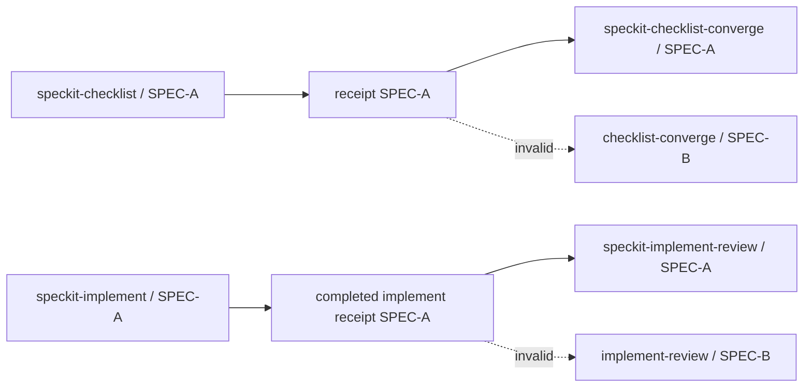
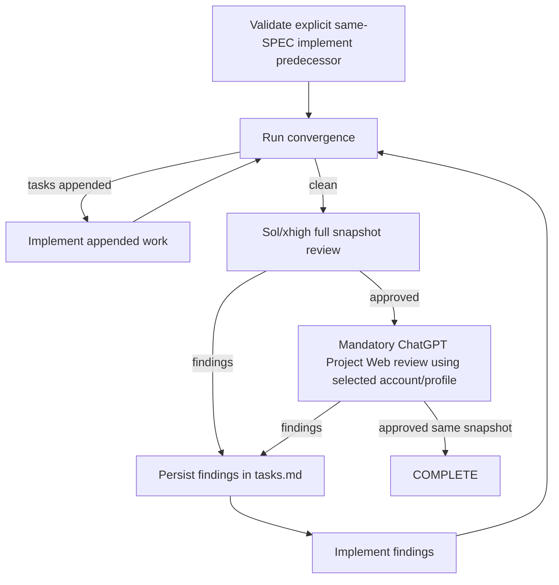

# SpecKit PowerPack

> **Status: Draft / pre-release.** The repository is intentionally evolving before its first stable public release.

SpecKit PowerPack is a composable enhancement layer for the official [GitHub Spec Kit](https://github.com/github/spec-kit). It does **not** fork or replace Spec Kit. It adds reusable workflow state, convergence, deep implementation review, full-cycle orchestration, technical-debt governance, executor-aware model routing, managed updates and a mandatory ChatGPT Project Web review gate.

## Current happy path

```text
speckit-specify
  -> speckit-clarify
  -> speckit-plan
  -> speckit-checklist
  -> speckit-checklist-converge
  -> speckit-tasks
  -> speckit-analyze
  -> speckit-implement
  -> speckit-implement-review
       -> speckit-converge
            -> tasks appended? speckit-implement -> speckit-converge ...
       -> independent Sol/xhigh review
            -> findings? implement fixes -> speckit-converge -> Sol review ...
       -> mandatory ChatGPT Project Web review
            -> findings? implement fixes -> speckit-converge -> Sol review -> Web review ...
            -> both gates approve same final snapshot? COMPLETE
            -> review budget exhausted? BLOCKED_BUDGET -> explicit extend
```

The first `speckit-implement` is mandatory and explicit. `speckit-implement-review` cannot manufacture or skip that predecessor; its first productive action is convergence.

## What PowerPack adds

- same-SPEC predecessor enforcement;
- `speckit-implement` wrapper with precise implementation receipts;
- explicit `implement -> implement-review` contract;
- integrated convergence/review/fix/re-convergence loop;
- Deep Review Evidence Protocol and schema 2.0 validator;
- durable review findings in `tasks.md`: `PENDING -> SELECTED -> IMPLEMENTED -> RESOLVED`;
- explicit review/convergence budgets with `BLOCKED_BUDGET` and user-authorized `extend N`;
- resumable `speckit-full-cycle` orchestration;
- governed technical-debt lifecycle;
- architecture/OS/language/framework/build-tool agnostic capability resolution;
- Codex-first Terra/Luna/Sol routing;
- mandatory ChatGPT Project Web second gate;
- isolated Playwright Chromium account profiles, independent from Windows Edge/Chrome;
- multiple ChatGPT accounts and multiple account bindings per Project;
- Project discovery, manual selection, known-URL binding and invite/shared-link acceptance;
- safe Spec Kit bootstrap/upgrade and PowerPack update/recovery.

## Core design rule

```text
DISCOVER CAPABILITY
        ↓
SELECT STRATEGY
        ↓
EXECUTE CONTRACT
```

Projects customize configuration, policy, domain skills and stricter gates rather than cloning generated PowerPack skills.

## Requirements

- Python 3.11+
- Git
- `uv`
- official Spec Kit `>=1.0.0` (PowerPack can bootstrap/upgrade to tested `v1.0.4`)
- Claude Code and/or Codex CLI
- Playwright + Chromium for mandatory ChatGPT Web review

Claude Code is **not required** for a Codex-first execution.

## Codex-first model routing

When `.specify/powerpack/model-routing.json` has `active_integration: "codex"`:

| Role | Model | Effort | Authority |
|---|---|---:|---|
| Parent / orchestrator / implementer | `gpt-5.6-terra` | high | writes, phase ownership, user interaction |
| Bounded mechanical worker | `gpt-5.6-luna` | medium | narrow scans/inventories/evidence collection |
| Semantic gate / advisor | `gpt-5.6-sol` | high | read-only semantic escalation |
| Independent deep reviewer | `gpt-5.6-sol` | xhigh | read-only review |

A Terra parent must **not** launch another `codex` CLI recursively just to review its own work. Use one in-session Sol/xhigh/read-only reviewer/subagent, or the current context only when that profile is already provable.

## Installation

### Install/update the CLI

```bash
uv tool install --force \
  git+https://github.com/ds1david/speckit-powerpack.git@main
```

### Existing Spec Kit project — Codex primary

From the project root:

```bash
git status --short
git branch --show-current

speckit-powerpack install . \
  --integration codex \
  --bootstrap-speckit
```

`--bootstrap-speckit` also upgrades an older incompatible Spec Kit installation to the tested release.

Installation materializes PowerPack and prepares Playwright/Chromium. It **does not silently authenticate ChatGPT or choose a Project**.

## ChatGPT Web onboarding: account first, Project second

PowerPack models Web review as:

```text
Playwright profile = authenticated ChatGPT account identity
Project binding    = Project context selected for this repository
```

The authenticated account is the Web reviewer identity. The Project is separate context.

### 1. Authorize a ChatGPT account

```bash
speckit-powerpack review auth authorize ds1david \
  --account-label ds1david-plus
```

A visible PowerPack Chromium profile opens. The profile is stored outside the repository and does **not** reuse the Windows Edge/Chrome user-data directory.

Credentials/MFA are entered only on ChatGPT.

A second account gets a second isolated profile:

```bash
speckit-powerpack review auth authorize webflow \
  --account-label webflow-plus
```

Inspect authorized accounts:

```bash
speckit-powerpack review auth list
```

Select the default account for later Project commands:

```bash
speckit-powerpack review auth use ds1david
```

Changing the active account alone does not silently change the repository's configured reviewer identity.

### 2. Discover and select an accessible Project

```bash
speckit-powerpack review project discover \
  --profile ds1david
```

Then bind one discovered Project:

```bash
speckit-powerpack review project select \
  --profile ds1david \
  --path .
```

Choose a known list index/alias:

```bash
speckit-powerpack review project select \
  --profile ds1david \
  --index 2 \
  --alias atsel \
  --path .
```

If sidebar discovery is incomplete, navigate to the Project manually:

```bash
speckit-powerpack review project select \
  --profile ds1david \
  --manual \
  --alias atsel \
  --path .
```

### 3. Known Project URL

```bash
speckit-powerpack review project add \
  'https://chatgpt.com/g/g-p-.../project' \
  --profile ds1david \
  --alias atsel \
  --path .
```

The Project is opened with that account before the binding is persisted.

### 4. Invite/shared Project link

```bash
speckit-powerpack review project accept-invite \
  '<chatgpt-invite-or-shared-link>' \
  --profile webflow \
  --alias atsel \
  --path .
```

Accept/join the Project in the visible browser if required. PowerPack persists the resulting Project URL only after the browser is actually on a Project.

### 5. One Project, multiple reviewer accounts

The same local Project alias may have several account bindings:

```text
atsel
└── linux
    ├── ds1david -> owner account
    └── webflow  -> shared collaborator account
```

Choose who performs Web review:

```bash
speckit-powerpack review project use atsel \
  --profile ds1david \
  --path .
```

or:

```bash
speckit-powerpack review project use atsel \
  --profile webflow \
  --path .
```

That selection writes the effective account/profile identity into `.specify/powerpack/review.json`. PowerPack must not silently substitute another account simply because that account can access the same shared Project.

### 6. Reconfigure an account

Reuse the current isolated profile:

```bash
speckit-powerpack review auth reconfigure ds1david \
  --account-label ds1david-plus
```

Start that PowerPack profile with fresh browser state:

```bash
speckit-powerpack review auth reconfigure ds1david \
  --account-label ds1david-plus \
  --fresh
```

Reauthorization intentionally marks previous Project bindings for that profile stale. Re-select/re-add the desired Project before review.

Forget one profile completely:

```bash
speckit-powerpack review auth forget webflow --path .
```

See [`docs/CHATGPT_WEB_ACCOUNTS.md`](docs/CHATGPT_WEB_ACCOUNTS.md) for the complete multi-account flow.

## Doctor and readiness

Normal diagnostics:

```bash
speckit-powerpack doctor
```

Missing ChatGPT account/Project onboarding is reported as `SETUP`, not as a broken PowerPack installation.

Strict readiness gate used before `speckit-implement-review`:

```bash
speckit-powerpack doctor --strict-review
```

Expected review readiness:

```text
OK web-review-required
OK playwright-package
OK playwright-browser
OK chatgpt-account-authenticated
OK chatgpt-project-bound
```

Real installation defects still fail normal `doctor`.

## Expected project review configuration

After binding a Project/account pair:

```json
{
  "chatgpt_web": {
    "required": true,
    "enabled": true,
    "project_alias": "atsel",
    "project_name": "...",
    "project_url": "https://chatgpt.com/g/g-p-.../project",
    "profile": "webflow",
    "account_label": "webflow-plus",
    "profile_scope": "platform",
    "profile_platform": "linux",
    "authorization": "playwright-account-consent"
  }
}
```

## Installed project layout

```text
.specify/
└── powerpack/
    ├── bin/
    │   ├── powerpack.py
    │   ├── capabilities.py
    │   ├── review_protocol.py
    │   ├── debt.py
    │   └── full_cycle.py
    ├── model-routing.json
    ├── prerequisites.json
    ├── quality-gates.json
    ├── review.json
    ├── full-cycle.json
    ├── technical-debt.json
    ├── update.json
    ├── deep-review-protocol.md
    ├── technical-debt-policy.md
    ├── technical-debt-template.md
    ├── state/
    └── runtime/
```

Machine-local browser state is outside the repository:

```text
<global PowerPack config>/
├── browser-install/<platform>.json
└── browser-profiles/
    ├── windows/<profile>/
    ├── linux/<profile>/
    └── macos/<profile>/
```

In WSL, profiles use the Linux namespace. They are not Windows Edge/Chrome profiles.

## Same-SPEC workflow safety

PowerPack does not treat artifact existence as proof that a predecessor actually ran.



The full-cycle safety floor includes:

```json
{
  "same_spec_only": true,
  "stop_on_blocked": true,
  "allow_debt_escape_hatch": false,
  "explicit_initial_implement_required": true,
  "implement_review_owns_convergence": true
}
```

## Canonical `speckit-implement-review`



Any implementation change invalidates earlier approvals and restarts convergence before fresh Sol and Web review.

Findings can never be converted to debt/backlog/TODO merely to force convergence.

If review budget is exhausted:

```text
speckit-implement-review extend 2
```

No silent extension is allowed.

## Capability-driven quality gates

No universal Maven/Gradle/npm/pytest command is embedded in workflow skills. `.specify/powerpack/bin/capabilities.py` discovers a reproducible strategy and fails closed on unknown/ambiguous architecture. Documentation-only implementation deltas may be `NOT_APPLICABLE`.

See [`docs/PORTABILITY.md`](docs/PORTABILITY.md).

## Full cycle

Top-level phases:

```text
clarify
→ plan
→ checklist/checklist-converge
→ tasks
→ analyze
→ implement
→ implement-review
→ DONE
```

`implement-review` owns its internal convergence and both review gates.

See [`docs/FULL_CYCLE.md`](docs/FULL_CYCLE.md).

## Technical-debt governance

Active SPEC work, convergence gaps, review findings and blockers cannot become debt merely to complete the workflow.

Default ledger: `docs/technical-debt.md`.

See [`docs/TECHNICAL_DEBT.md`](docs/TECHNICAL_DEBT.md).

## Updates and recovery

```bash
speckit-powerpack update . --check
speckit-powerpack update .
speckit-powerpack update . --yes
```

Forced recovery inside the PowerPack ownership boundary:

```bash
speckit-powerpack update . --force --yes
```

Project-only rematerialization:

```bash
speckit-powerpack update . --project-only --force --yes
```

Reset mutable PowerPack project configuration only after explicit approval:

```bash
speckit-powerpack update . --project-only --force --reset-config --yes
```

The updater never authorizes destructive Git reset/rebase/force-push or deletion of project source/debt/browser profiles.

See [`docs/UPDATES.md`](docs/UPDATES.md).

## Session/usage limits

Claude/Codex usage/rate/session limits are classified separately from build/test errors. Safe checkpoints contain only resumable execution context, never passwords, cookies, MFA or raw browser authentication material.

A temporary Claude Code limit does not require changing the SDD workflow. Switch the active integration to Codex and continue from the same SPEC state.

## Documentation

- [`docs/CODEX_FIRST_INSTALL.md`](docs/CODEX_FIRST_INSTALL.md) — existing-project migration with Codex as primary executor.
- [`docs/CHATGPT_WEB_ACCOUNTS.md`](docs/CHATGPT_WEB_ACCOUNTS.md) — isolated account profiles, multi-account Project bindings, invites and switching reviewer identity.
- [`docs/CUSTOMIZATION.md`](docs/CUSTOMIZATION.md) — customization boundaries.
- [`docs/PROCESS_ARCHITECTURE.md`](docs/PROCESS_ARCHITECTURE.md) — end-to-end process architecture.
- [`docs/IMPLEMENT_REVIEW.md`](docs/IMPLEMENT_REVIEW.md) — deep review + convergence evidence contract.
- [`docs/FULL_CYCLE.md`](docs/FULL_CYCLE.md) — full-cycle state machine.
- [`docs/TECHNICAL_DEBT.md`](docs/TECHNICAL_DEBT.md) — debt lifecycle.
- [`docs/UPDATES.md`](docs/UPDATES.md) — updater/recovery process.
- [`docs/PORTABILITY.md`](docs/PORTABILITY.md) — agnostic capability design.

## Security / safety boundaries

- Codex independent review uses Sol/xhigh/read-only semantics.
- Terra owns writes; Sol reviewers do not implement findings.
- Recursive Codex CLI spawning for review is forbidden.
- ChatGPT Web requires account-scoped Playwright consent plus a Project binding.
- The selected Playwright profile/account is the Web reviewer identity.
- Each account has its own isolated persistent profile.
- PowerPack never reuses the default Edge/Chrome user-data directory.
- Reauthentication invalidates previous Project trust for that profile.
- Passwords/MFA/raw cookies are not written to project configuration.
- PowerPack workflows do not authorize merge, GitHub approval, ready-for-review, force-push or destructive reset.
- Technical debt cannot hide current-flow blockers/findings.

## Development and CI

```bash
python -m pip install -e '.[dev]'
pytest -q
python -m build --wheel
```

GitHub Actions runs Ubuntu/Windows/macOS × Python 3.11/3.13 for non-draft PRs and pushes to `main`.

## License

MIT. See [LICENSE](LICENSE).
