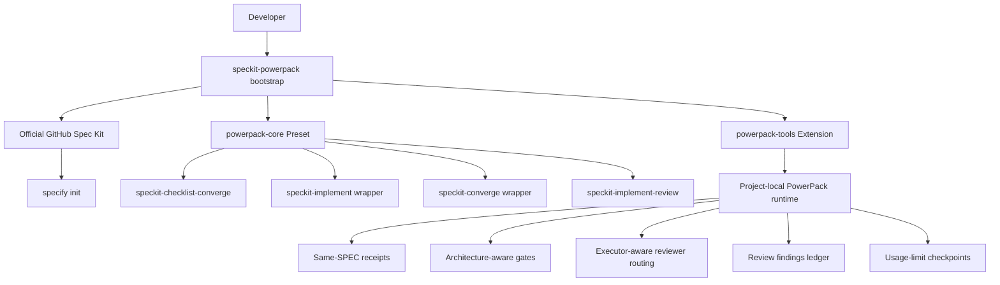
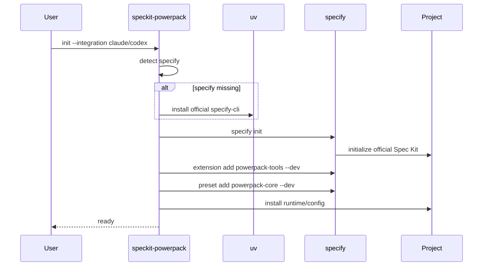
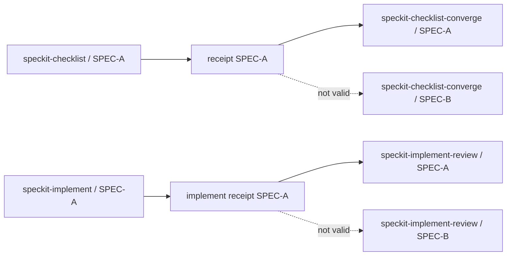
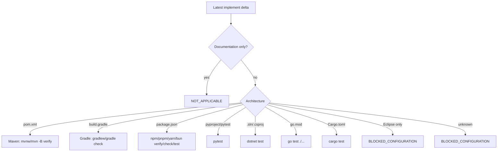
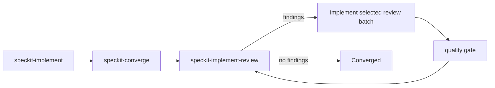
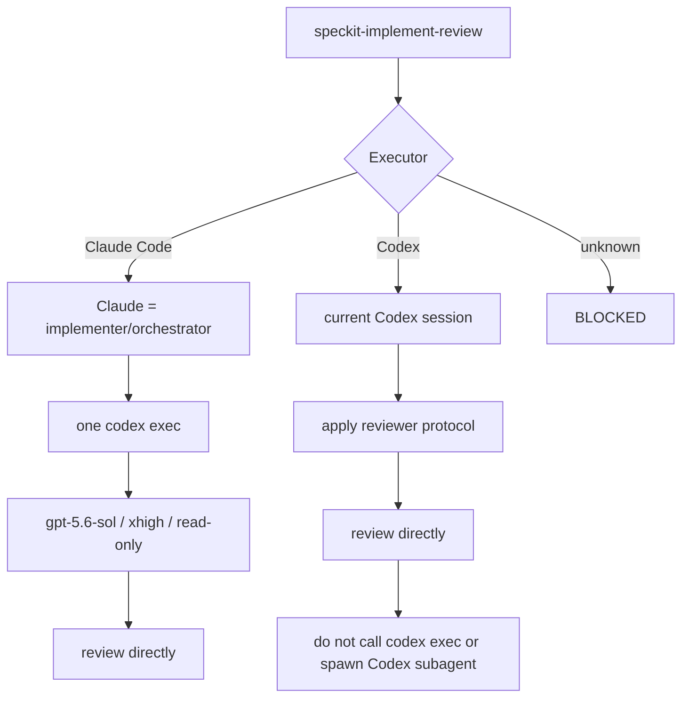
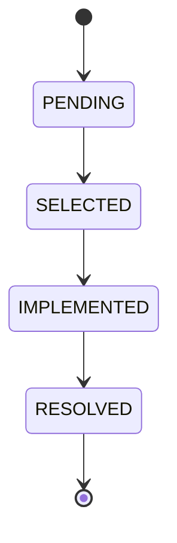
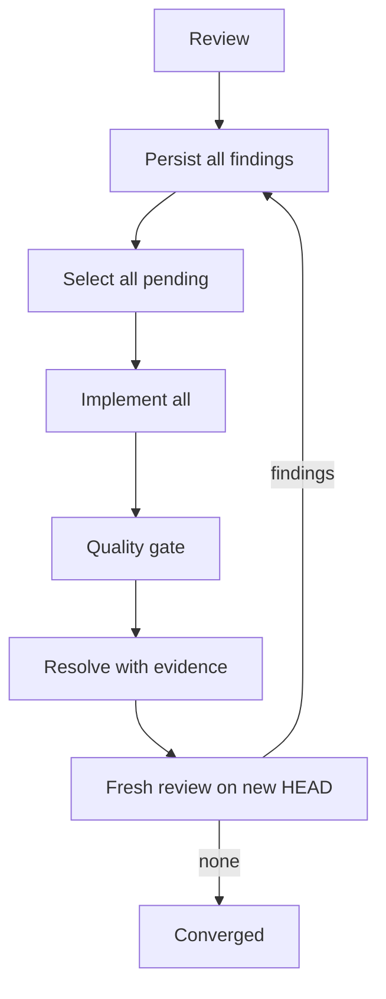
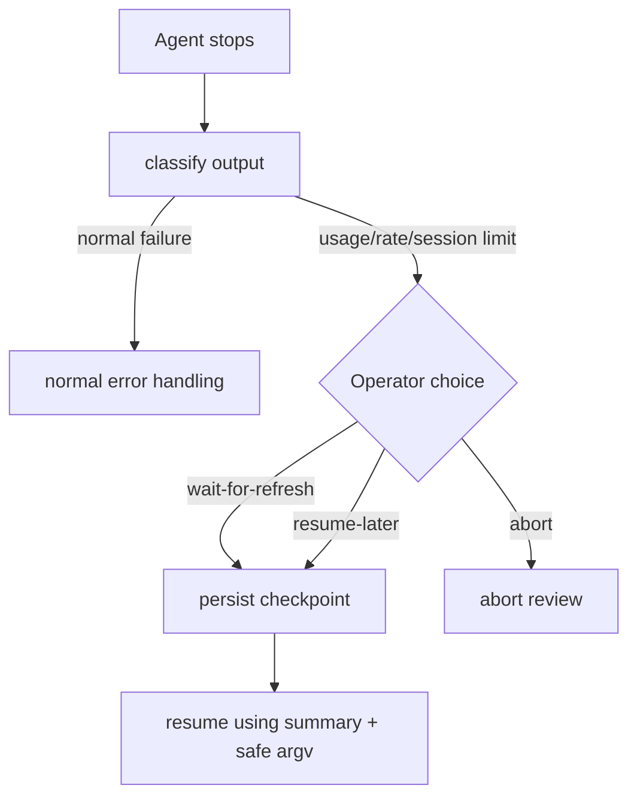

# SpecKit PowerPack

> **Status: Draft / pre-release.** The repository is intentionally being evolved in public-ready form before its first stable release.

SpecKit PowerPack is a composable enhancement layer for the official [GitHub Spec Kit](https://github.com/github/spec-kit). It does **not** fork or replace Spec Kit. It bootstraps the official `specify` CLI, installs PowerPack components through Spec Kit's native **Preset** and **Extension** mechanisms, and adds stricter workflow policies for prerequisite enforcement, requirements convergence and independent implementation review.

## What this draft adds

- `speckit-checklist-converge` — requirements-writing convergence after `speckit-checklist`.
- `speckit-implement-review` — independent implementation-review convergence after at least one `speckit-implement` run for the **same SPEC**.
- Same-SPEC predecessor receipts instead of trusting artifact existence.
- Precise `speckit-implement` delta capture, including already-dirty worktrees.
- Architecture-aware quality gates instead of a universal Maven command.
- Documentation-only rounds return `NOT_APPLICABLE` and skip executable gates.
- Claude Code / Codex executor-aware reviewer routing.
- Codex deep-review profile: `gpt-5.6-sol`, `xhigh`, `read-only`.
- Review findings persisted into `tasks.md` with batch convergence.
- Interactive and automatic review modes.
- Optional ChatGPT Project assisted second gate and browser-profile management.
- Usage/session-limit checkpoints and resumable execution.
- Review abort that removes ephemeral state without losing findings or authentication/project bindings.

## Architecture



PowerPack deliberately avoids directly editing generated `.claude/skills/*` or `.agents/skills/*` files as its source of truth. Spec Kit materializes agent-facing commands from the installed preset/extension.

## Why no Spec Kit fork?

A fork would require continuously merging upstream command changes. PowerPack instead composes the official commands:


Where a core command is wrapped, `{CORE_TEMPLATE}` keeps the upstream command body authoritative.

## Requirements

Current draft:

- Python 3.11+
- Git
- `uv` when PowerPack must bootstrap official Spec Kit
- Claude Code and/or Codex CLI
- Playwright only for the optional ChatGPT Project Web gate

Independent-review routing is explicit:

| Executor | Reviewer | Recursive Codex spawn |
|---|---|---|
| Claude Code | one external `codex exec` | forbidden |
| Codex | current Codex session | forbidden |
| unknown/other | `BLOCKED` | not attempted |

The deep reviewer contract is currently `gpt-5.6-sol / xhigh / read-only`.

## Install in a new project

During the draft phase, install from GitHub:

```bash
uv tool install speckit-powerpack \
  --from git+https://github.com/ds1david/speckit-powerpack.git
```

Initialize a new project with Claude Code:

```bash
mkdir my-project
cd my-project
speckit-powerpack init . --integration claude
```

Or Codex:

```bash
speckit-powerpack init . --integration codex
```

Bootstrap flow:



For an existing Spec Kit project:

```bash
speckit-powerpack install . --integration claude
```

If `specify` is missing and PowerPack should install it:

```bash
speckit-powerpack install . --integration claude --bootstrap-speckit
```

Diagnose:

```bash
speckit-powerpack doctor
```

## Same-SPEC predecessor enforcement

PowerPack does not accept "a file exists" as proof a workflow predecessor ran.



`checklist-converge` requires a completed checklist receipt for the same SPEC. `implement-review` requires at least one completed implement receipt for the same SPEC.

## Precise `speckit-implement` delta

The implement wrapper snapshots content before execution and compares it after successful completion. A file already dirty before the round is not attributed to `speckit-implement` unless its content changes again during that round.

This precise delta is also the basis for deciding whether an executable quality gate is necessary.

## Architecture-aware quality gates

There is no universal `./mvnw -B verify` rule.



Override discovery in `.specify/powerpack/quality-gates.json`:

```json
{
  "schema_version": 1,
  "policy": "auto-detect",
  "custom_command": ["make", "verify"]
}
```

A Java/Eclipse project without a reproducible CLI build remains explicitly blocked until a custom gate is configured.

## `speckit-implement-review`

Responsibilities are intentionally separated:

- `speckit-checklist-converge` → requirements/document quality;
- `speckit-converge` → implementation completeness vs. spec/plan/tasks;
- `speckit-implement-review` → independent technical quality.

Conceptual loop:



### Executor-aware reviewer routing

PowerPack prevents a class of deterministic `BLOCKED` failures caused by contradictory instructions such as "do not invoke another agent" combined with "MUST spawn a reviewer subagent".

The requirement is the **effective reviewer profile**, not an unconditional child-agent mechanism:



This specifically supports `codex exec` headless review without asking that headless session to recursively create another Codex session.

## Findings are durable work in `tasks.md`

Every finding is persisted before implementation.



PowerPack appends a `## PowerPack Review Findings` section using stable IDs such as `REV-a12bc34def`.

Example:

```markdown
- [ ] REV-a12bc34def [REVIEW][PENDING][codex][HIGH] Race in state transition | evidence: src/Foo.java:82 | source-round: 2
```

Resolved:

```markdown
- [x] REV-a12bc34def [REVIEW][RESOLVED][codex][HIGH] Race in state transition | evidence: src/Foo.java:82 | source-round: 2 | resolution: synchronized transition and regression test
```

Repeated findings with the same provider/title/location fingerprint are deduplicated instead of being lost or duplicated silently.

## Interactive mode

```text
CODE REVIEW
    ↓
all findings → tasks.md as PENDING
    ↓
display simplified table
    ↓
user selects implementation batch
    ↓
SELECTED → implementation → IMPLEMENTED
    ↓
quality gate
    ↓
RESOLVED + evidence
    ↓
remaining findings?
    ├─ yes → next batch or stop
    └─ no  → fresh review round
```

## Automatic mode



Findings are not converted to backlog, TODO or technical debt just to make the review converge.

## Optional ChatGPT Project gate

Codex is the primary independent reviewer. The Web gate is optional:

- no ChatGPT Project bound → Codex-only;
- project bound → Codex then assisted ChatGPT Project review on the same HEAD;
- Web finding changes the implementation → Codex must review the new HEAD again.

Install browser support only when needed:

```bash
speckit-powerpack review setup --install-browser
```

Login with an isolated persistent profile:

```bash
speckit-powerpack review auth login personal
```

Bind a project:

```bash
speckit-powerpack review project bind \
  atsel \
  'https://chatgpt.com/g/g-p-.../project' \
  --profile personal
```

Use it in the current repo:

```bash
speckit-powerpack review project use atsel
```

Logout or remove local authentication state:

```bash
speckit-powerpack review auth logout personal
speckit-powerpack review auth forget personal
```

Credentials and MFA are entered only in the real browser. PowerPack does not request passwords through the CLI.

## Session/usage limits

Long Claude/Codex loops may hit usage limits. PowerPack distinguishes those from code/test failures:



A checkpoint can contain SPEC, review round, selected finding IDs, last gate, next action and a known refresh timestamp. It must never contain passwords, browser cookies, MFA values or raw authentication material.

## Abort semantics

```bash
python .specify/powerpack/bin/powerpack.py review abort
```

Abort removes ephemeral local review-run state while preserving:

- findings already written to `tasks.md`;
- implementation changes;
- browser authentication profiles;
- ChatGPT Project bindings.

This allows abandoning a broken review run without destroying its audit trail.

## Runtime layout

```text
.specify/
└── powerpack/
    ├── bin/powerpack.py
    ├── model-routing.json
    ├── prerequisites.json
    ├── quality-gates.json
    ├── review.json
    ├── state/
    │   └── <spec>.json
    └── runtime/                 # gitignored ephemeral state
        ├── reviews/
        └── limit-checkpoint.json
```

Browser profiles live outside the repository:

```text
~/.config/speckit-powerpack/
├── config.json
└── browser-profiles/
    ├── personal/
    └── work/
```

## Security boundaries

- Codex review is read-only.
- Passwords/MFA are never collected by the PowerPack CLI.
- Browser profiles are outside the source repository.
- Ephemeral review state is gitignored.
- Review commands do not authorize merge, GitHub approval, ready-for-review, force-push or destructive reset.
- Review abort never deletes durable findings.

## Development

```bash
python -m pip install -e '.[dev]'
pytest -q
```

Tests cover same-SPEC predecessor isolation, checklist receipt enforcement, dirty-worktree delta tracking, documentation-only gates, Maven/Gradle/Eclipse behavior, Claude→Codex routing, Codex local-session routing without recursion, `xhigh` review effort, finding deduplication/state transitions, abort persistence and usage-limit classification.

## Draft roadmap

Before a stable public release, PowerPack is expected to add more skills/workflows, catalog/release assets for fully catalog-driven Spec Kit Bundle installation, broader integration adapters and CI smoke tests across the primary agents. The current CLI remains a bootstrap/UX layer; the long-term source of truth is still Spec Kit-native presets, extensions and workflows.

## License

MIT. See [LICENSE](LICENSE).
