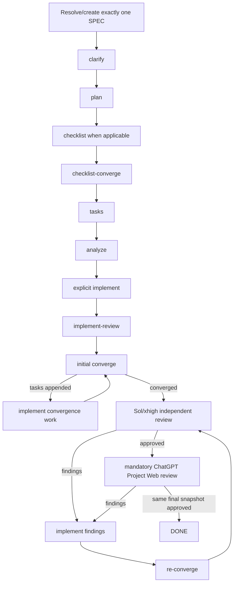

# Full Cycle

`speckit-full-cycle` composes existing Spec Kit and PowerPack primitives for exactly one SPEC. It is orchestration, not a second implementation of the commands it calls.

The top-level flow deliberately preserves the first implementation as a separate mandatory phase:



The top-level state machine does **not** expose a standalone `converge` phase after the initial `implement`. Convergence and both review gates belong to `speckit-implement-review`.

## Runtime state machine

State is persisted per SPEC by:

```text
package:   src/speckit_powerpack/assets/runtime/powerpack_full_cycle.py
installed: .specify/powerpack/bin/full_cycle.py
state:     .specify/powerpack/runtime/full-cycle/<spec>.json
```

Start/status/resume:

```bash
python .specify/powerpack/bin/full_cycle.py start --feature-dir <SPEC_DIR>
python .specify/powerpack/bin/full_cycle.py status --feature-dir <SPEC_DIR>
python .specify/powerpack/bin/full_cycle.py resume --feature-dir <SPEC_DIR> --unblock
```

Authoritative top-level phases:

```text
clarify
→ plan
→ checklist
→ checklist_converge
→ tasks
→ analyze
→ implement
→ implement_review
→ DONE
```

`specify` normally creates/selects the SPEC before the cycle starts. Later owner-stage returns may re-enter `specify`/`clarify` when feature intent itself changes.

Intermediate convergence tasks and review findings remain inside the active `implement_review` phase until the skill reaches dual approval, a real blocker or an explicit budget boundary.

## Mandatory predecessor and readiness

`implement_review` cannot be enabled without `implement`. A successful PowerPack `speckit-implement` records the same-SPEC receipt; a receipt from another SPEC does not satisfy the gate.

The intended transition is always:

```text
analyze → implement → implement-review
```

Before review work, `speckit-implement-review` also requires `speckit-powerpack doctor` to prove the current executor and mandatory isolated ChatGPT Web authorization/project binding are ready.

## Configuration

Project customization:

```text
.specify/powerpack/full-cycle.json
```

Safe customization includes mode, optional pre-implementation phases and round limits.

Non-weakenable invariants:

```json
{
  "same_spec_only": true,
  "stop_on_blocked": true,
  "allow_debt_escape_hatch": false,
  "explicit_initial_implement_required": true,
  "implement_review_owns_convergence": true
}
```

## Integrated implementation-review

After the explicit initial implementation, the review stage owns:

```text
converge
  -> tasks appended? implement -> converge ...
  -> Sol/xhigh review
       -> findings? implement -> converge -> Sol review ...
  -> mandatory ChatGPT Project Web review
       -> findings? implement -> converge -> Sol review -> Web review ...
  -> both gates approve same final snapshot
```

Any implementation change invalidates earlier approvals. Web findings therefore force re-convergence and a fresh Sol approval before another Web review.

Only after both gates approve the same final snapshot may the top-level runtime record:

```bash
python .specify/powerpack/bin/full_cycle.py advance \
  --feature-dir <SPEC_DIR> \
  --phase implement_review \
  --outcome approved \
  --evidence "convergence clean; quality gate green/N-A; Sol and Web approved same final snapshot"
```

## Review budget

If review budget is exhausted before dual approval:

```text
Stage Handoff: BLOCKED_BUDGET
Suggested: speckit-implement-review extend 2
```

After explicit authorization for more rounds, resume the same review run and unblock the top-level state. No new initial `speckit-implement` is required merely to continue that same review run.

## Codex-first routing

With `active_integration=codex`:

| Role | Model | Effort | Authority |
|---|---|---:|---|
| Parent/orchestrator/implementation | `gpt-5.6-terra` | high | writes, phase ownership, user interaction |
| Bounded worker | `gpt-5.6-luna` | medium | narrow evidence/inventory work |
| Semantic gate/advisor | `gpt-5.6-sol` | high | read-only semantic escalation |
| Independent deep reviewer | `gpt-5.6-sol` | xhigh | read-only review |

A Terra parent never launches a recursive `codex` CLI to review. The Web gate is browser-based and uses only the PowerPack-authorized isolated Playwright profile.

## Resume and abort

Usage/session limits use the normal PowerPack checkpoint mechanism while the cycle state retains the exact top-level phase. `abort` removes only the ephemeral full-cycle state; SPEC artifacts, source changes, receipts and durable review findings remain intact.

## Completion

`DONE` means the current SPEC passed its explicit initial implementation, integrated convergence, capability-selected quality gate, independent Sol/xhigh review and mandatory ChatGPT Project Web review on the **same final snapshot**.

It does not approve, mark ready or merge a GitHub pull request.
