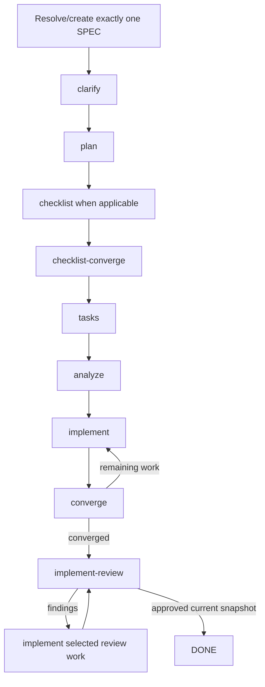

# Full Cycle

`speckit-full-cycle` composes the existing Spec Kit and PowerPack primitives for exactly one SPEC. It is orchestration, not a second implementation of the commands it calls.



## Runtime state machine

The orchestration state is persisted per SPEC by:

```text
Package source:
src/speckit_powerpack/assets/runtime/powerpack_full_cycle.py

Installed runtime:
.specify/powerpack/bin/full_cycle.py

Ephemeral/resumable state:
.specify/powerpack/runtime/full-cycle/<spec>.json
```

Start:

```bash
python .specify/powerpack/bin/full_cycle.py start --feature-dir <SPEC_DIR>
```

Inspect/resume:

```bash
python .specify/powerpack/bin/full_cycle.py status --feature-dir <SPEC_DIR>
python .specify/powerpack/bin/full_cycle.py resume --feature-dir <SPEC_DIR>
```

After each phase, the skill records the outcome with `advance`. The runtime validates that the reported phase is actually current and enforces loop limits.

A convergence result `needs-implementation` sends the state back to `implement` and records `return_after_implement=converge`. Review findings do the same with `return_after_implement=implement_review`. This prevents an agent from accidentally continuing to a later phase after a correction round.

## Configuration

Project customization:

```text
.specify/powerpack/full-cycle.json
```

Packaged default:

```text
src/speckit_powerpack/assets/config/default-full-cycle.json
```

Safe customization includes:

- `mode`: `interactive` or `auto`;
- enabling/disabling optional phases;
- `max_convergence_rounds`;
- `max_review_rounds`.

These safety invariants are non-weakenable:

```json
{
  "same_spec_only": true,
  "stop_on_blocked": true,
  "allow_debt_escape_hatch": false
}
```

If a project changes one of them, `full_cycle.py start` returns `BLOCKED_CONFIGURATION`.

## Resume and abort

Usage/session limits use the normal PowerPack checkpoint mechanism while the cycle state retains the exact current phase. `abort` removes only `.specify/powerpack/runtime/full-cycle/<spec>.json`; SPEC artifacts, source changes, receipts and review findings remain intact.

## Completion

The workflow never changes SPEC implicitly. Material ambiguity or a blocked prerequisite stops the run even in auto mode. Convergence gaps and active implementation-review findings cannot be converted to technical debt to end the cycle.

`DONE` means the current SPEC converges with implementation and independent deep review approves the current snapshot. It does not approve, mark ready or merge a GitHub pull request.
