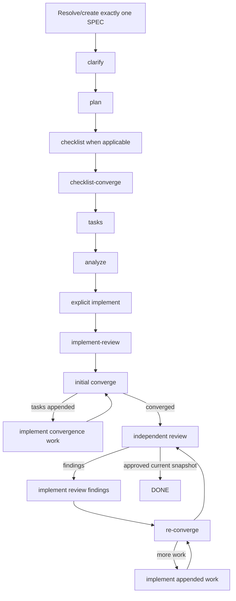

# Full Cycle

`speckit-full-cycle` composes the existing Spec Kit and PowerPack primitives for exactly one SPEC. It is orchestration, not a second implementation of the commands it calls.

The top-level flow deliberately preserves the first implementation as a separate mandatory phase:



The top-level state machine therefore does **not** expose a standalone `converge` phase after the initial `implement`. That convergence belongs to `speckit-implement-review` so the immediately required productive predecessor of review remains the explicit implementation.

## Runtime state machine

The orchestration state is persisted per SPEC by:

```text
Package source:
src/speckit_powerpack/assets/runtime/powerpack_full_cycle.py

Installed runtime:
.specify/powerpack/bin/full_cycle.py

Ephemeral/resumable state:
.specify/powerpack/runtime/full-cycle/<spec>.json
```

Start:

```bash
python .specify/powerpack/bin/full_cycle.py start --feature-dir <SPEC_DIR>
```

Inspect/resume:

```bash
python .specify/powerpack/bin/full_cycle.py status --feature-dir <SPEC_DIR>
python .specify/powerpack/bin/full_cycle.py resume --feature-dir <SPEC_DIR>
```

After each top-level phase, the skill records the outcome with `advance`. The runtime validates that the reported phase is actually current.

The authoritative top-level phases are:

```text
clarify
→ plan
→ checklist
→ checklist_converge
→ tasks
→ analyze
→ implement
→ implement_review
→ DONE
```

`specify` normally creates/selects the SPEC before the cycle starts. Later owner-stage returns may re-enter `specify`/`clarify` when the feature intent itself changes.

Intermediate convergence tasks and review findings do **not** advance the top-level runtime. They remain inside the active `implement_review` phase until that skill reaches approval, a real blocker, or an explicit budget boundary.

## Mandatory predecessor

`implement_review` cannot be enabled without `implement`.

A successful PowerPack `speckit-implement` records the same-SPEC predecessor receipt. `speckit-implement-review` verifies that receipt before doing any convergence or review work. A receipt from another SPEC does not satisfy the gate.

This means the intended happy path is always:

```text
analyze → implement → implement-review
```

and never:

```text
analyze → implement-review
```

## Configuration

Project customization:

```text
.specify/powerpack/full-cycle.json
```

Packaged default:

```text
src/speckit_powerpack/assets/config/default-full-cycle.json
```

Safe customization includes:

- `mode`: `interactive` or `auto`;
- enabling/disabling optional pre-implementation phases;
- `max_convergence_rounds` consumed inside `implement-review`;
- `max_review_rounds` consumed inside `implement-review`.

These safety invariants are non-weakenable:

```json
{
  "same_spec_only": true,
  "stop_on_blocked": true,
  "allow_debt_escape_hatch": false,
  "explicit_initial_implement_required": true,
  "implement_review_owns_convergence": true
}
```

Older project configuration files that do not yet contain the last two keys are interpreted with the safe value `true`. Setting either one explicitly to `false` blocks a new cycle.

## Review budget

If `speckit-implement-review` consumes its configured review budget without a valid approval, the top-level state may be recorded as `BLOCKED_BUDGET` while remaining on `implement_review`.

After explicit user authorization, extend the review run, for example:

```text
speckit-implement-review extend 2
```

Then resume the full-cycle state with `--unblock`. No new initial implementation is required merely to continue the same review run.

## Codex-first routing

With `active_integration=codex`, the default PowerPack roles are:

| Role | Model | Effort | Authority |
|---|---|---:|---|
| Parent/orchestrator/implementation | `gpt-5.6-terra` | high | writes, phase ownership, user interaction |
| Bounded mechanical worker | `gpt-5.6-luna` | medium | narrow evidence/inventory work |
| Semantic gate/advisor | `gpt-5.6-sol` | high | read-only semantic escalation |
| Independent deep reviewer | `gpt-5.6-sol` | xhigh | read-only review |

A Terra parent never launches a recursive `codex` CLI to review. The Sol reviewer is either an in-session reviewer/subagent or the current context when that context is already provably Sol/xhigh/read-only.

## Resume and abort

Usage/session limits use the normal PowerPack checkpoint mechanism while the cycle state retains the exact current top-level phase. `abort` removes only `.specify/powerpack/runtime/full-cycle/<spec>.json`; SPEC artifacts, source changes, receipts and review findings remain intact.

## Completion

The workflow never changes SPEC implicitly. Material ambiguity or a blocked prerequisite stops the run even in auto mode. Convergence gaps and active implementation-review findings cannot be converted to technical debt to end the cycle.

`DONE` means the current SPEC passed its explicit initial implementation, integrated convergence, quality gates and independent deep review on the final snapshot. It does not approve, mark ready or merge a GitHub pull request.
