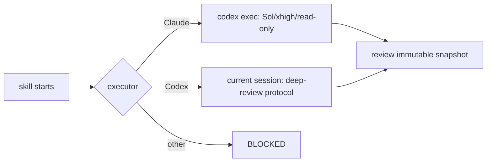
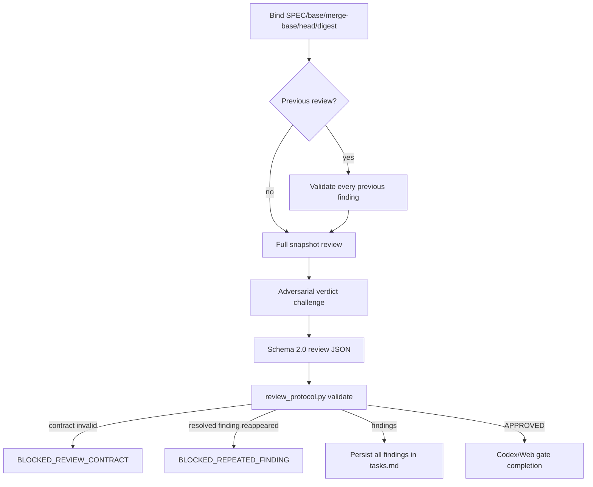

# `speckit-implement-review` contract

This document is the human-readable summary of the PowerPack implementation review. The installed reviewer protocol is `.specify/powerpack/deep-review-protocol.md`; its package source is `src/speckit_powerpack/assets/review/deep-review-protocol.md`.

## Invariants

1. The current SPEC must have a completed `speckit-implement` receipt for the same SPEC.
2. Claude Code uses one external Codex reviewer; Codex reviews in the current session and never recursively opens another Codex reviewer.
3. The deep-review profile is `gpt-5.6-sol`, reasoning effort `xhigh`, sandbox `read-only`.
4. Every review round is bound to a full base/merge-base/head/snapshot identity.
5. Every changed file must be accounted for as inspected evidence.
6. On round 2+, every previous finding is explicitly revalidated before the full snapshot is reviewed again.
7. Every round ends with an adversarial attempt to invalidate its own verdict.
8. The reviewer JSON must pass `.specify/powerpack/bin/review_protocol.py` before findings or approval are accepted.
9. A finding declared `RESOLVED` that materially reappears is `BLOCKED_REPEATED_FINDING`, not silently deduplicated into another loop.
10. Every valid finding is written to `tasks.md` before implementation.
11. Interactive mode implements only selected findings; automatic mode selects every pending finding.
12. A finding moves through `PENDING → SELECTED → IMPLEMENTED → RESOLVED`.
13. A quality gate is selected by project capabilities, not hard-coded to a language/framework/tool.
14. Documentation-only implementation work does not execute an application build gate.
15. New implementation changes invalidate approvals associated with an earlier HEAD.
16. Aborting removes ephemeral review state, never the durable finding ledger or browser/project authentication bindings.

## Reviewer routing

The distinction between **reviewer identity/profile** and **spawn mechanism** prevents impossible requirements such as demanding a custom child agent from a headless `codex exec` context that cannot spawn it.

## Deep-review round

Required fronts are:

- `SPEC_COMPLIANCE`
- `BEHAVIORAL_REGRESSION`
- `ARCHITECTURE_AND_CONTRACTS`
- `STATE_CONCURRENCY_AND_FAILURES`
- `PERSISTENCE_DETERMINISM_IDEMPOTENCY`
- `TESTS_AND_COMPOSITION_ROOT`
- `DOCUMENTATION_AND_OPERABILITY`
- `SECURITY_AND_SCOPE`

`APPROVED` requires `findings: []`, every changed file inspected, no partial/failed requirement, no baseline regression, all previous findings resolved and all fronts `PASS` or evidence-backed `NOT_APPLICABLE`.

## ChatGPT Web second gate

When configured, Web review is a second independent gate on the same HEAD and uses the same evidence contract. It does not inherit trust from the Codex approval.

Browser profiles and project bindings are platform-scoped. Windows, Linux/WSL and macOS may use the same human-readable profile name while keeping completely separate persistent browser storage/authentication.

A Web finding that changes code invalidates the prior Codex approval and sends the new HEAD back to Codex review.

## Customization

See [`CUSTOMIZATION.md`](CUSTOMIZATION.md) for configuration surfaces and [`PROCESS_ARCHITECTURE.md`](PROCESS_ARCHITECTURE.md) for the end-to-end flow mapped to exact source/runtime files.
