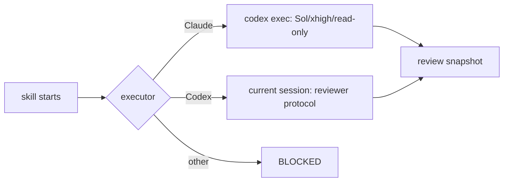

# `speckit-implement-review` contract

This document is the human-readable protocol for the PowerPack implementation review.

## Invariants

1. The current SPEC must have a completed `speckit-implement` receipt.
2. Claude Code uses one external Codex reviewer; Codex reviews in the current session and never recursively opens another Codex reviewer.
3. The deep-review profile is `gpt-5.6-sol`, reasoning effort `xhigh`, sandbox `read-only`.
4. Every finding is written to `tasks.md` before implementation.
5. Interactive mode implements only selected findings; automatic mode selects every pending finding.
6. A finding moves through `PENDING → SELECTED → IMPLEMENTED → RESOLVED`.
7. A quality gate is inferred from the project architecture, not hard-coded to Maven.
8. Documentation-only implementation work does not execute an application build gate.
9. New implementation changes invalidate approvals associated with an earlier HEAD.
10. Aborting removes ephemeral review state, never the durable finding ledger.

## Reviewer routing

The distinction between **reviewer identity** and **spawn mechanism** prevents impossible requirements such as demanding a custom child agent from a headless `codex exec` context that cannot spawn it.
