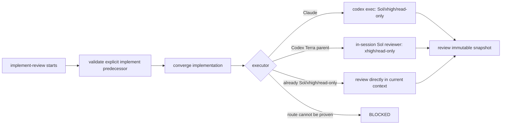
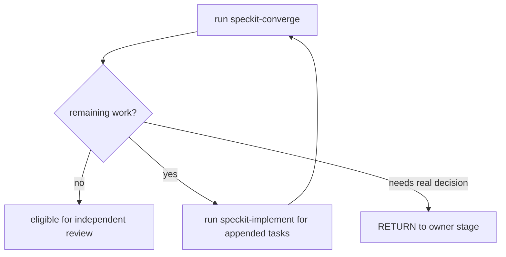
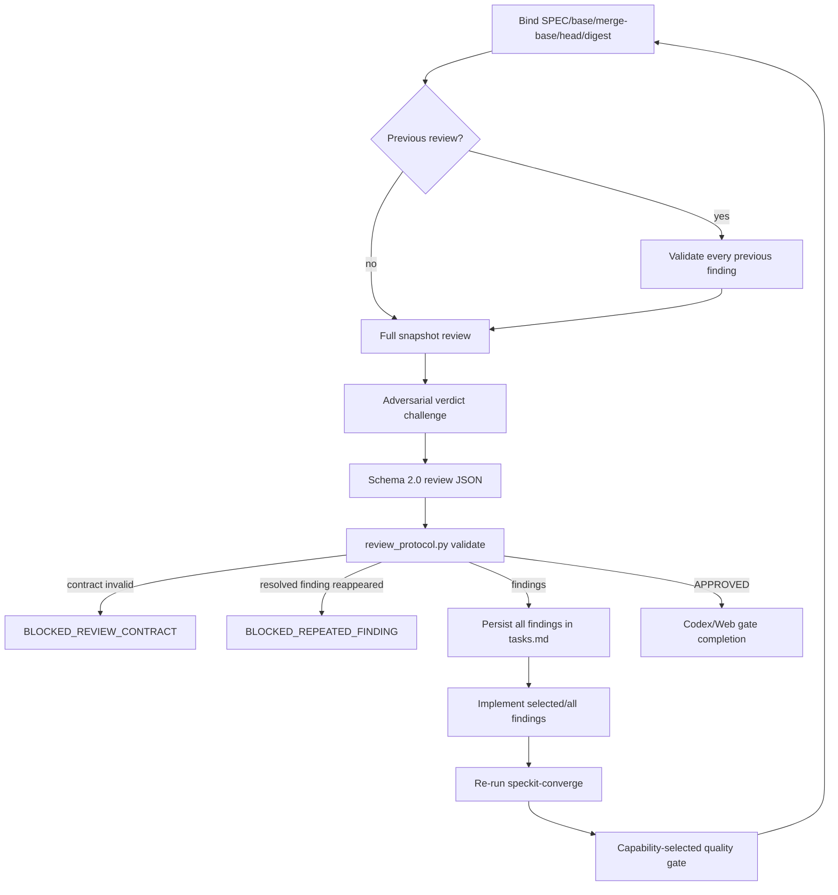

# `speckit-implement-review` contract

This document is the human-readable summary of the PowerPack implementation review. The installed reviewer protocol is `.specify/powerpack/deep-review-protocol.md`; its package source is `src/speckit_powerpack/assets/review/deep-review-protocol.md`.

## Happy path

The initial implementation is deliberately explicit and cannot be skipped:

```text
speckit-analyze
→ speckit-implement
→ speckit-implement-review
    → speckit-converge
        → tasks appended? speckit-implement → speckit-converge
    → independent review
        → findings? implement fixes → speckit-converge → review
    → COMPLETE
```

`implement-review` is therefore not “perform the initial implementation and then review it”. It means “take the implementation just produced by `speckit-implement`, prove convergence, review it independently, repair every finding and re-prove convergence until the snapshot is approvable”.

## Invariants

1. The current SPEC must have a completed explicit `speckit-implement` receipt for the same SPEC.
2. `speckit-implement-review` MUST NOT call `speckit-implement` merely to manufacture the missing initial predecessor.
3. The first productive action after predecessor validation is `speckit-converge`.
4. If convergence appends tasks, `speckit-implement` executes those corrective tasks and returns immediately to convergence inside the same active review run.
5. Claude Code uses one external Codex reviewer; a Codex/Terra parent uses one in-session Sol reviewer/subagent when it is not already running in the required reviewer profile. Recursive `codex` CLI spawning is forbidden.
6. The deep-review profile is `gpt-5.6-sol`, reasoning effort `xhigh`, sandbox `read-only`.
7. The Codex parent/orchestrator/implementer profile is `gpt-5.6-terra`, reasoning effort `high`; bounded mechanical work may use `gpt-5.6-luna`.
8. Every review round is bound to a full base/merge-base/head/snapshot identity.
9. Every changed file must be accounted for as inspected evidence.
10. On round 2+, every previous finding is explicitly revalidated before the full snapshot is reviewed again.
11. Every round ends with an adversarial attempt to invalidate its own verdict.
12. Reviewer JSON must pass `.specify/powerpack/bin/review_protocol.py` before findings or approval are accepted.
13. A finding declared `RESOLVED` that materially reappears is `BLOCKED_REPEATED_FINDING`, not silently deduplicated into another loop.
14. Every valid finding is written to `tasks.md` before implementation.
15. Interactive mode implements only selected findings; automatic mode selects every pending finding.
16. A finding moves through `PENDING → SELECTED → IMPLEMENTED → RESOLVED`.
17. After any finding-driven implementation change, `speckit-converge` runs again before another approval is accepted.
18. A quality gate is selected by project capabilities, not hard-coded to a language/framework/tool.
19. Documentation-only implementation work does not execute an application build gate.
20. New implementation changes invalidate approvals associated with an earlier HEAD.
21. Review/convergence budgets are explicit and are never extended silently.
22. Aborting removes ephemeral review state, never the durable finding ledger or browser/project authentication bindings.

## Reviewer routing



The distinction between **reviewer identity/profile** and **spawn mechanism** prevents two bad states:

- a Terra parent reviewing its own implementation without an independent Sol gate;
- recursive `codex -> codex` process spawning merely to change reviewer identity.

## Convergence loop

Before the first review and after every finding-driven code change:



The configured `max_convergence_rounds` defaults to 5. If deterministic work remains when the budget ends, the run stops and asks for explicit continuation rather than silently increasing the budget.

## Deep-review round



Required fronts are:

- `SPEC_COMPLIANCE`
- `BEHAVIORAL_REGRESSION`
- `ARCHITECTURE_AND_CONTRACTS`
- `STATE_CONCURRENCY_AND_FAILURES`
- `PERSISTENCE_DETERMINISM_IDEMPOTENCY`
- `TESTS_AND_COMPOSITION_ROOT`
- `DOCUMENTATION_AND_OPERABILITY`
- `SECURITY_AND_SCOPE`

`APPROVED` requires `findings: []`, every changed file inspected, no partial/failed requirement, no baseline regression, all previous findings resolved and all fronts `PASS` or evidence-backed `NOT_APPLICABLE`.

## Review budget / extend

`max_review_rounds` defaults to 5. When the current snapshot still lacks a valid approval and the configured budget is exhausted, the skill finishes with:

```text
Stage Handoff: BLOCKED_BUDGET
Suggested: speckit-implement-review extend 2
```

`extend N` resumes the same review run and current SPEC. It does not require a new initial `speckit-implement` merely because the review budget was increased.

## ChatGPT Web second gate

When configured, Web review is a second independent gate on the same HEAD and uses the same evidence contract. It does not inherit trust from the Codex approval.

Browser profiles and project bindings are platform-scoped. Windows, Linux/WSL and macOS may use the same human-readable profile name while keeping completely separate persistent browser storage/authentication.

A Web finding that changes code invalidates the prior Codex approval, requires convergence again and sends the new HEAD back to Codex review.

The Web gate remains optional; when it is not configured, a Codex-only run can still converge.

## Terminal UX

The installed skill shows planned routing before material work and repeats the same routing rows at completion with observed result/timing fields. Conditional routes are visibly conditional. If timing cannot be measured, the report uses `N/D` rather than an estimate.

Material human decisions use one question at a time and the final report includes a Stage Handoff (`RETURN`, `LOOP`, `COMPLETE`, `BLOCKED` or `BLOCKED_BUDGET`).

## Customization

See [`CUSTOMIZATION.md`](CUSTOMIZATION.md) for configuration surfaces and [`PROCESS_ARCHITECTURE.md`](PROCESS_ARCHITECTURE.md) for the end-to-end flow mapped to exact source/runtime files.
