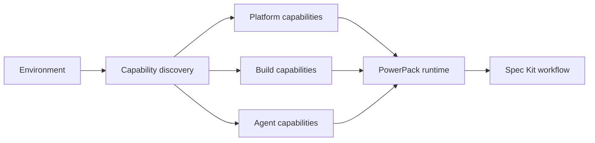

# Portability and Agnostic Execution Contract

SpecKit PowerPack preserves the same workflow semantics across operating systems, programming languages, frameworks and build tools.

## Core invariant

Workflow skills MUST NOT contain product logic such as `if Windows`, `if Java`, `if Maven`, `if Node`, or equivalent ecosystem branches. They ask the runtime for capabilities and strategies instead.



The invariant is:

```text
DISCOVER CAPABILITY -> SELECT STRATEGY -> EXECUTE CONTRACT
```

Equivalent projects with equivalent capabilities must receive equivalent workflow decisions regardless of host OS, source language or framework.

## Operating systems

Windows, Linux and macOS are first-class design targets. Platform-specific details are centralized in `PlatformCapabilities`.

Examples:

- wrapper suffix resolution (`mvnw` vs `mvnw.cmd`, `gradlew` vs `gradlew.cmd`);
- Spec Kit prerequisite runner priority (PowerShell first on Windows, Bash first on POSIX);
- native global config roots in the Python bootstrap CLI;
- executable discovery through `shutil.which`.

No review/checklist/implementation skill selects an OS-specific command directly.

## Languages, frameworks and build tools

Quality gates are selected from a strategy registry based on reproducible project descriptors, not source-file language guesses.

Current strategies include Maven, Gradle, Node package scripts, tox, explicitly configured pytest, .NET, Go and Rust. Projects may always define an explicit `custom_command` argv list.

Fail-closed rules:

- `pyproject.toml` alone does not imply pytest;
- Eclipse metadata does not imply Maven;
- a detected build descriptor with a missing executable is `BLOCKED_CONFIGURATION`;
- multiple detected build strategies are ambiguous and require an explicit gate;
- unknown architectures require an explicit custom gate;
- documentation-only implementation rounds are `NOT_APPLICABLE` independently of OS/framework/language.

## Cross-platform CI

Every pull request executes unit tests and wheel validation on six environments:

- Ubuntu + Python 3.11;
- Ubuntu + Python 3.13;
- Windows + Python 3.11;
- Windows + Python 3.13;
- macOS + Python 3.11;
- macOS + Python 3.13.

Tests also inject platform contexts so wrapper selection is deterministic and testable independent of the runner host.

## Adding another ecosystem

Add a gate strategy to the capability registry. Do not modify `speckit-implement-review` semantics.

A strategy must provide:

1. deterministic capability detection;
2. a reproducible argv list, not a shell-concatenated command;
3. fail-closed behavior when its executable is unavailable;
4. tests proving unrelated strategies keep the same behavior.

This keeps PowerPack OS-agnostic, language-agnostic, framework-agnostic, build-tool-agnostic and extensible.
