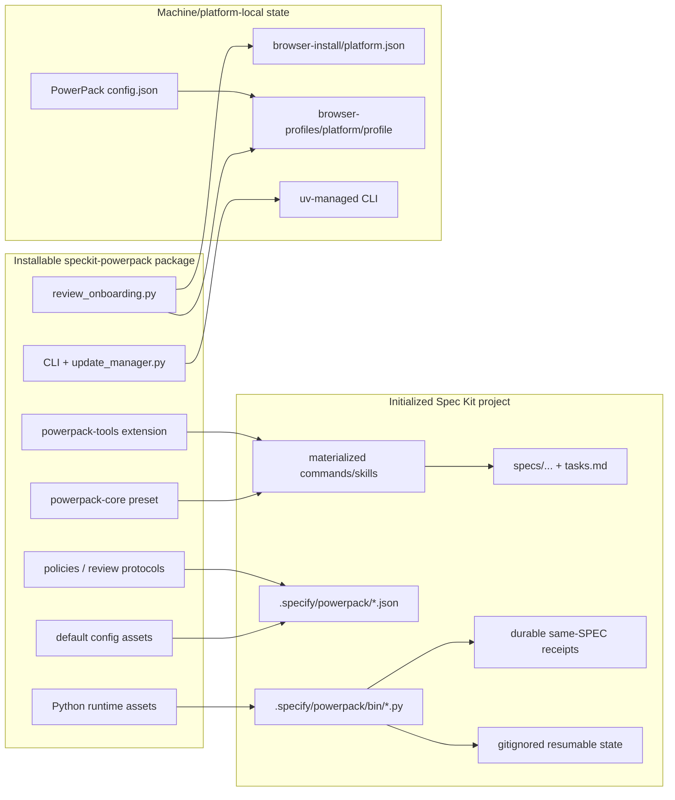
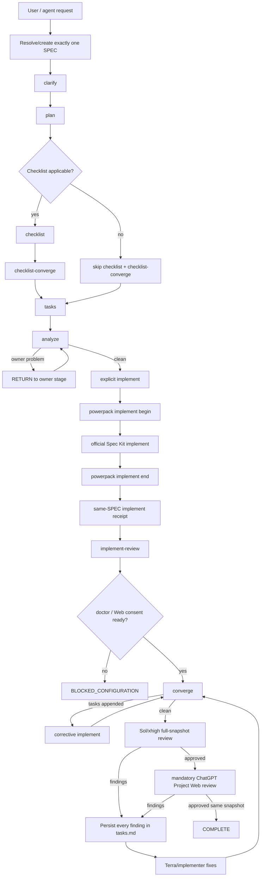
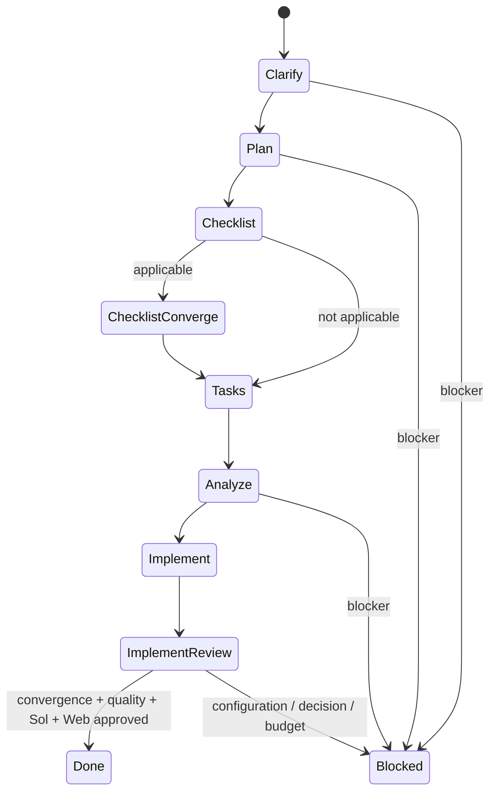
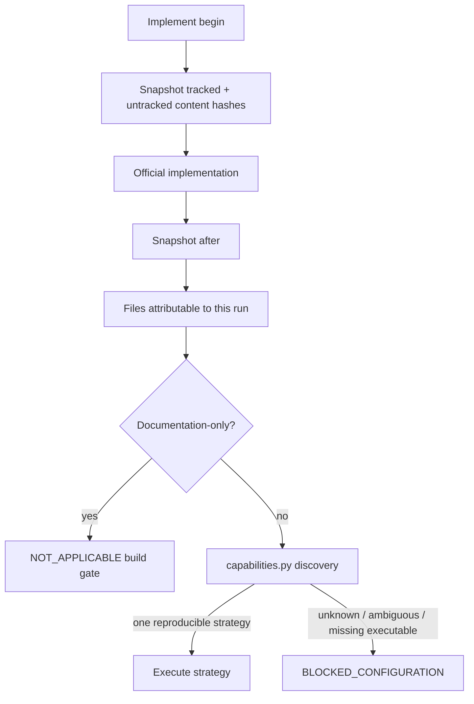
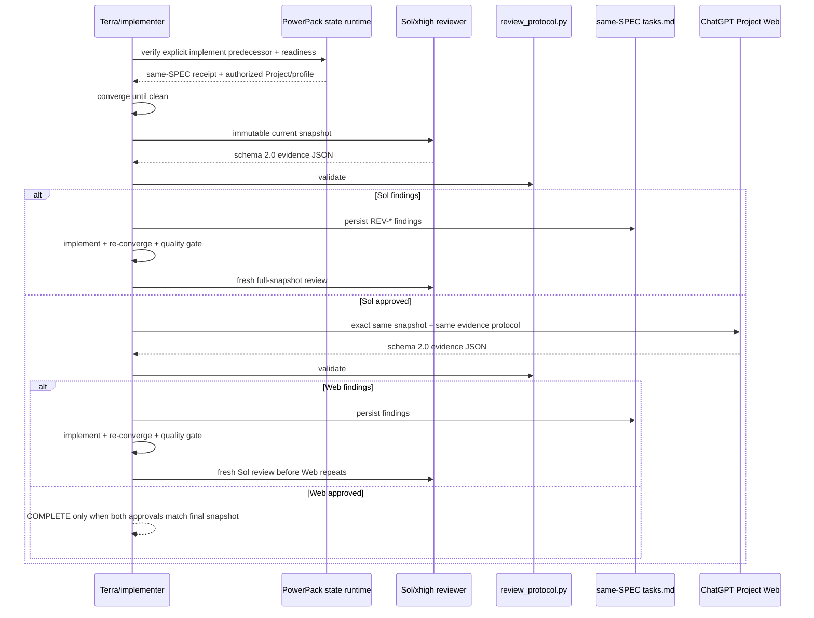
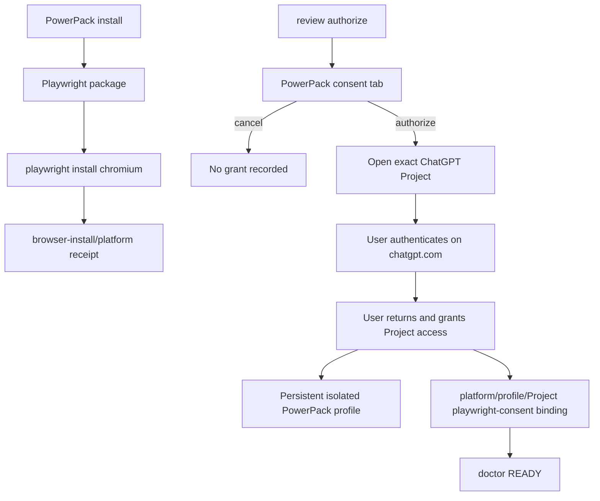
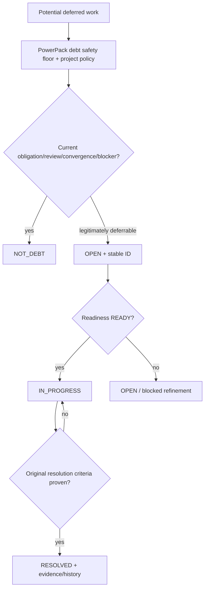
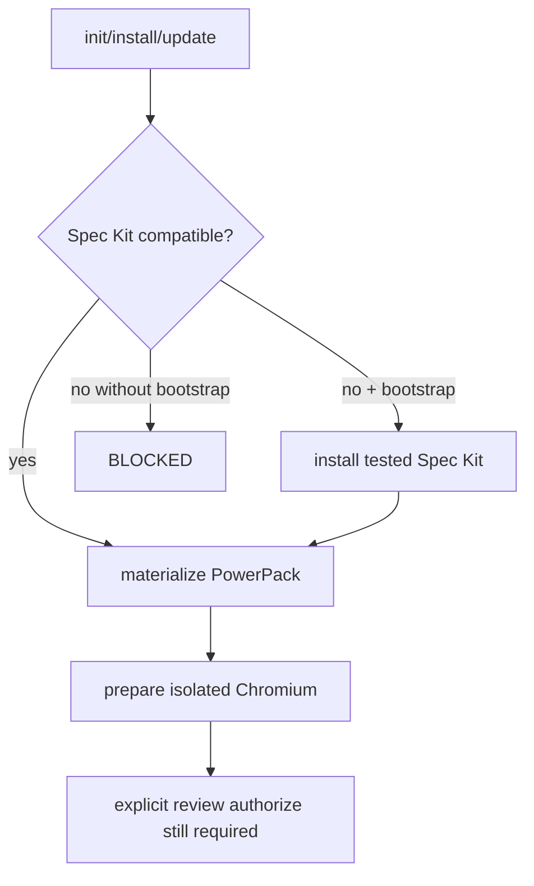
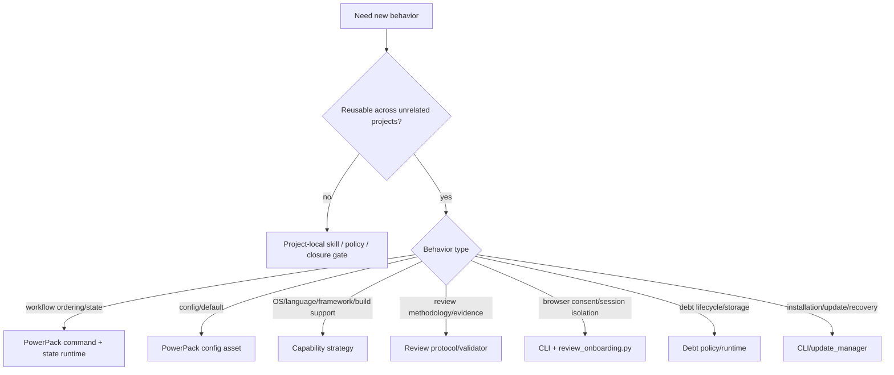

# PowerPack Process Architecture

This is the canonical map from PowerPack process nodes to their implementation, installed project artifact, durable/ephemeral state and supported customization surface.

The reusable design rule is:

```text
project intent / stricter policy
        ↓
PowerPack workflow contract
        ↓
capability / state / evidence runtime
        ↓
Spec Kit primitive / Sol reviewer / mandatory Web gate
        ↓
auditable result
```

OS, language, framework, IDE and build-tool differences are resolved behind capabilities/configuration rather than embedded as workflow branches.

# 1. Package → project → machine layers



Generated `.claude/skills/*` and `.agents/skills/*` files are materialized views, not the durable customization source.

# 2. End-to-end feature process



There is no top-level `converge` between the initial `implement` and `implement-review`. Convergence is owned by the integrated review stage.

# 3. Top-level full-cycle state machine



The full-cycle runtime controls only top-level phase order. Corrective implementation/convergence and both review gates remain inside `implement_review`.

Non-weakenable configuration:

```json
{
  "same_spec_only": true,
  "stop_on_blocked": true,
  "allow_debt_escape_hatch": false,
  "explicit_initial_implement_required": true,
  "implement_review_owns_convergence": true
}
```

# 4. Implementation and quality gate



Project-specific closure checks belong in project policy/gates. PowerPack supplies the generic capability contract, not framework-specific assumptions.

# 5. Deep implementation review



A previous approval becomes stale after any implementation change. No review finding may be converted to technical debt merely to force completion.

# 6. Isolated Playwright Web identity and consent



Machine-local layout:

```text
<global PowerPack config>/
├── config.json
├── browser-install/<platform>.json
└── browser-profiles/
    ├── windows/<profile>/
    ├── linux/<profile>/
    └── macos/<profile>/
```

The persistent Playwright context deliberately does **not** reuse the default Edge/Chrome profile. WSL uses the Linux namespace even when Windows browsers are already authenticated.

Canonical authorization command:

```bash
speckit-powerpack review authorize \
  --profile <profile> \
  --project <alias> \
  --url 'https://chatgpt.com/g/g-p-.../project' \
  --path .
```

`doctor` requires a matching `playwright-consent` grant. Legacy login/bind state without that grant does not satisfy readiness.

# 7. Technical-debt governance



# 8. Install, update and forced recovery

Installation and update are scoped to PowerPack-managed assets. `--bootstrap-speckit` installs or upgrades an incompatible Spec Kit to the tested version before preset/extension materialization. Project configuration is preserved unless an explicitly confirmed reset is requested.



Forced updater recovery never authorizes Git reset/rebase/force-push, deletion of project source/debt history, or deletion of PowerPack browser profiles.

# 9. Session-limit resume

Usage/session/rate limits are checkpointed separately from code/test failures. Checkpoints contain safe resumable execution context, never passwords, cookies, MFA codes or raw browser authentication material.

# 10. Change decision guide



Examples that stay project-local: trading-specific invariants, Oracle APEX metadata rules, a specific backend-to-frontend traceability implementation.

Examples that belong in PowerPack: same-SPEC receipts, generic convergence/review lifecycle, evidence contracts, capability resolution, technical-debt governance mechanics, top-level orchestration, isolated Playwright consent/profile handling and safe updater/recovery behavior.

See also [`CUSTOMIZATION.md`](CUSTOMIZATION.md), [`IMPLEMENT_REVIEW.md`](IMPLEMENT_REVIEW.md), [`FULL_CYCLE.md`](FULL_CYCLE.md), [`TECHNICAL_DEBT.md`](TECHNICAL_DEBT.md), [`UPDATES.md`](UPDATES.md) and [`PORTABILITY.md`](PORTABILITY.md).
