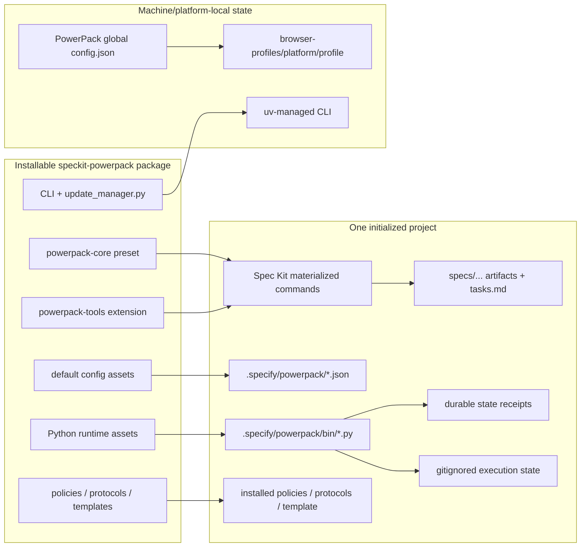
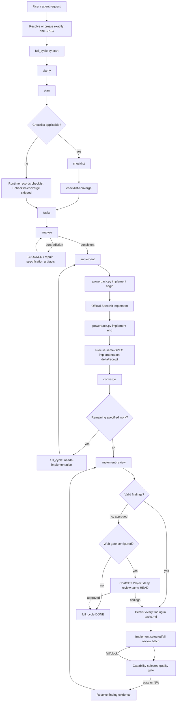
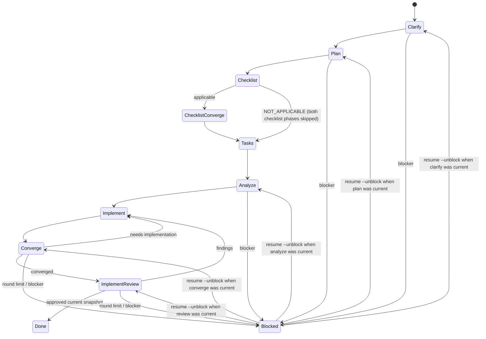
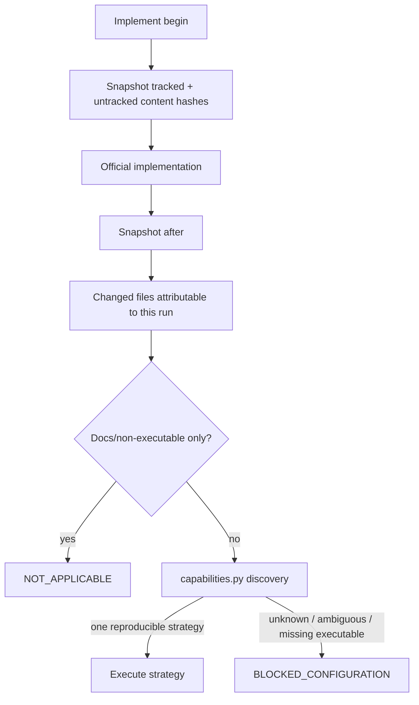
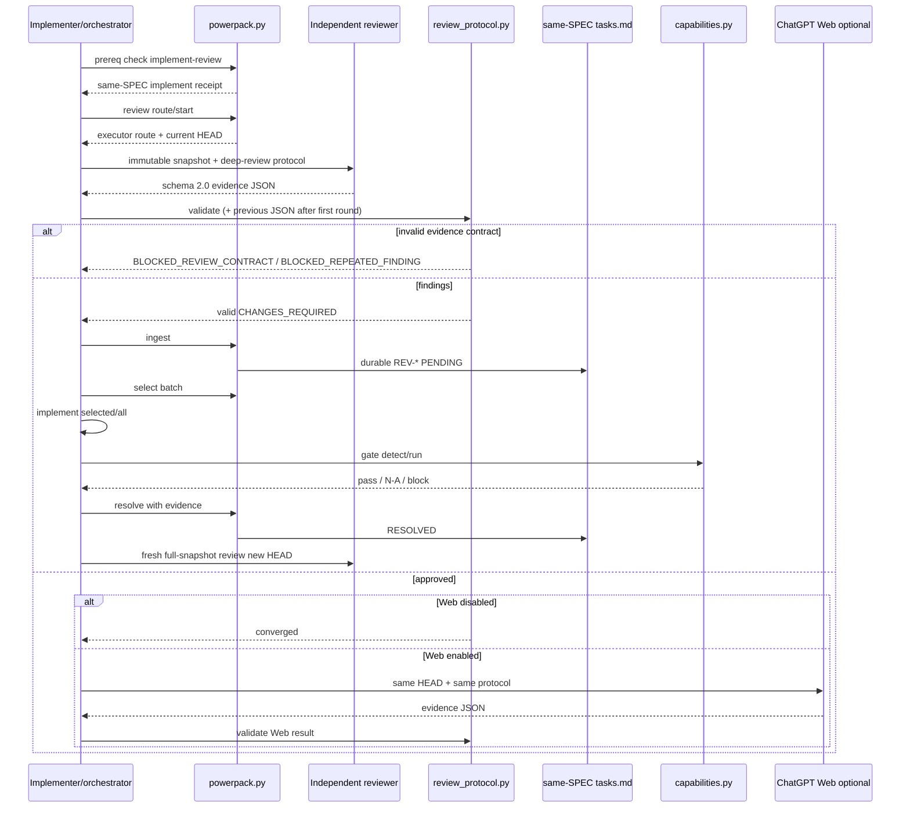
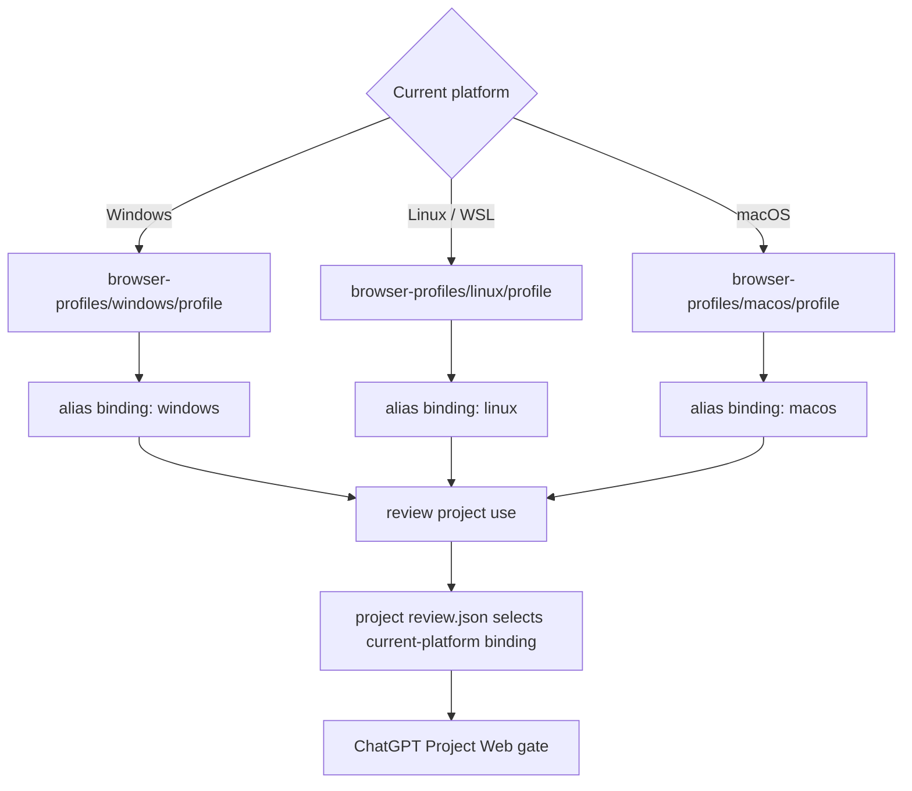
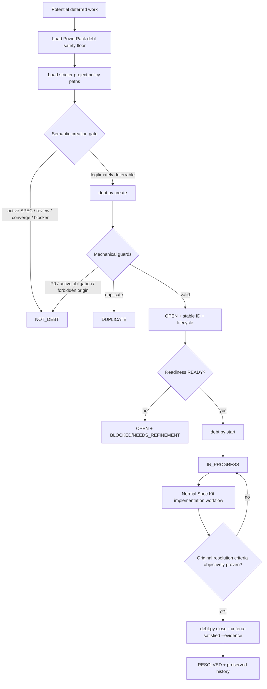
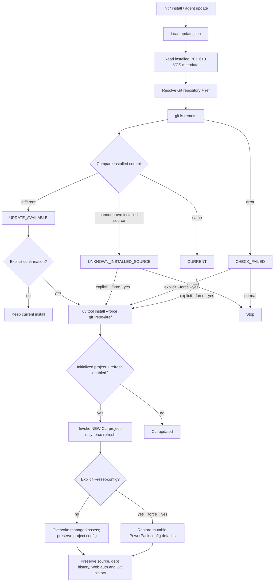
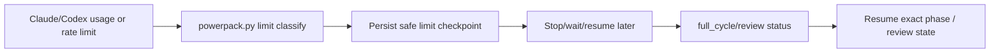
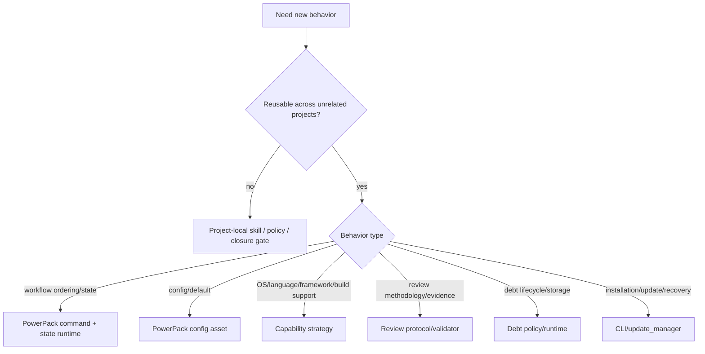

# PowerPack Process Architecture

This is the canonical map from PowerPack process nodes to their implementation, installed project artifact, durable/ephemeral state and supported customization surface.

The reusable design rule is:

```text
project intent / stricter policy
        ↓
PowerPack workflow contract
        ↓
capability / state / evidence runtime
        ↓
Spec Kit primitive / reviewer / external gate
        ↓
auditable result
```

OS, language, framework, IDE and build-tool differences must be resolved behind capabilities/configuration rather than embedded as branches in workflow skills.

# 1. Package → project → machine layers



**Durable customization source:** package source, project `.specify/powerpack` configuration/policies and project-local skills/gates.

**Not a durable customization source:** generated `.claude/skills/*`, `.agents/skills/*` or other materialized agent copies.

# 2. End-to-end feature process



The `full_cycle.py` state is authoritative for which phase may execute next. A blocked state requires explicit resume/unblock before another `advance` call.

# 3. Full-cycle state machine



State stores `return_after_implement`, so a correction implementation deterministically returns to either `converge` or `implement_review`.

## Full-cycle file map

| Concern | Package source | Installed/project location | Customization |
|---|---|---|---|
| workflow prompt | `assets/presets/powerpack-core/commands/speckit.full-cycle.md` | materialized by Spec Kit | package change only for generic orchestration semantics |
| default phases/limits | `assets/config/default-full-cycle.json` | `.specify/powerpack/full-cycle.json` | mode, optional phases, round limits |
| state machine | `assets/runtime/powerpack_full_cycle.py` | `.specify/powerpack/bin/full_cycle.py` | package-level reusable state semantics only |
| execution state | runtime-created | `.specify/powerpack/runtime/full-cycle/<spec>.json` | do not hand-edit; use start/status/advance/resume/abort |

Non-weakenable config: `same_spec_only=true`, `stop_on_blocked=true`, `allow_debt_escape_hatch=false`.

# 4. Implementation and capability gate



| Concern | Package source | Installed location | Customization |
|---|---|---|---|
| receipts/delta | `assets/runtime/powerpack_runtime.py` | `.specify/powerpack/bin/powerpack.py` | generic package semantics only |
| capability strategies | `assets/runtime/powerpack_capabilities.py` | `.specify/powerpack/bin/capabilities.py` | add reusable architecture strategies here |
| project gate override | generated by `cli.py` | `.specify/powerpack/quality-gates.json` | explicit argv `custom_command` |

A project-specific traceability/closure script belongs to the project; PowerPack only needs a generic contract for invoking it when/if a reusable closure-gate mechanism is configured.

# 5. Deep implementation review



## Review file map

| Concern | Package source | Installed/project location | Customization |
|---|---|---|---|
| canonical skill | `assets/presets/powerpack-core/commands/speckit.implement-review.md` | materialized command | generic workflow only |
| runtime routing/findings | `assets/runtime/powerpack_runtime.py` | `.specify/powerpack/bin/powerpack.py` | package state semantics |
| evidence validator | `assets/runtime/powerpack_review_protocol.py` | `.specify/powerpack/bin/review_protocol.py` | schema evolution at package level |
| methodology | `assets/review/deep-review-protocol.md` | `.specify/powerpack/deep-review-protocol.md` | project may add stricter domain probes |
| review config | `assets/config/default-review.json` | `.specify/powerpack/review.json` | modes/Web selection/profile settings |
| model routing | `assets/config/default-model-routing.json` | `.specify/powerpack/model-routing.json` | stage model mappings; reviewer contract stays independent |

# 6. Platform-scoped ChatGPT Web identity



Implementation is `src/speckit_powerpack/cli.py`. Persistent identity lives outside the repository under the platform-native PowerPack config root. Projects select bindings through CLI commands; they should not copy raw browser profile directories between OSes.

# 7. Technical-debt governance and lifecycle



## Debt file map

| Concern | Package source | Installed/project location | Customization |
|---|---|---|---|
| debt skills | `assets/presets/powerpack-core/commands/speckit.debt-*.md` | materialized commands | project policy provides domain semantics |
| deterministic ledger | `assets/runtime/powerpack_debt.py` | `.specify/powerpack/bin/debt.py` | generic storage/lifecycle behavior |
| floor policy | `assets/policies/technical-debt.md` | `.specify/powerpack/technical-debt-policy.md` | project may only become stricter |
| config | `assets/config/default-technical-debt.json` | `.specify/powerpack/technical-debt.json` | backlog path, prefix, project policies |
| default backlog shape | `assets/templates/technical-debt-backlog.md` | `.specify/powerpack/technical-debt-template.md` | project may bind an established deterministic format/adapter |
| actual default ledger | created by debt runtime | `docs/technical-debt.md` | version-controlled project backlog |

# 8. Install, update and forced recovery



## Update file map

| Concern | Package source | Installed/project location | Customization |
|---|---|---|---|
| update policy | `assets/config/default-update.json` | `.specify/powerpack/update.json` | channel/ref/check/refresh policy |
| installed source/ref resolver | `src/speckit_powerpack/update_manager.py` | installed CLI package | package-level updater semantics |
| install/update orchestration | `src/speckit_powerpack/cli.py` | `speckit-powerpack` executable | CLI flags/config |
| agent-facing update skill | `assets/extensions/powerpack-tools/commands/update.md` | materialized extension command | project may add stricter approval policy |
| managed project refresh | `cli.py::install_support/install_components` | `.specify/powerpack` + Spec Kit components | configs preserved by default |

`--force` is brute-force only inside the PowerPack ownership boundary. `--reset-config` is a separate stronger action and requires explicit `--force --yes`. No updater path authorizes Git reset/rebase/force-push or deletion of project source/debt/browser profiles.

# 9. Session-limit resume



Limit checkpoints contain safe execution context, never passwords, cookies, MFA or raw browser authentication.

# 10. Change decision guide



Examples that stay project-local: WASAPI lifecycle, WSL-first policy, trading-specific invariants, Oracle APEX metadata rules, a specific backend-to-frontend route traceability implementation.

Examples that belong in PowerPack: same-SPEC receipts, generic convergence/review lifecycle, evidence contracts, capability resolution, technical-debt governance mechanics, full-cycle orchestration, platform-scoped Web identity and safe updater/recovery behavior.

See also [`CUSTOMIZATION.md`](CUSTOMIZATION.md), [`IMPLEMENT_REVIEW.md`](IMPLEMENT_REVIEW.md), [`FULL_CYCLE.md`](FULL_CYCLE.md), [`TECHNICAL_DEBT.md`](TECHNICAL_DEBT.md), [`UPDATES.md`](UPDATES.md) and [`PORTABILITY.md`](PORTABILITY.md).
