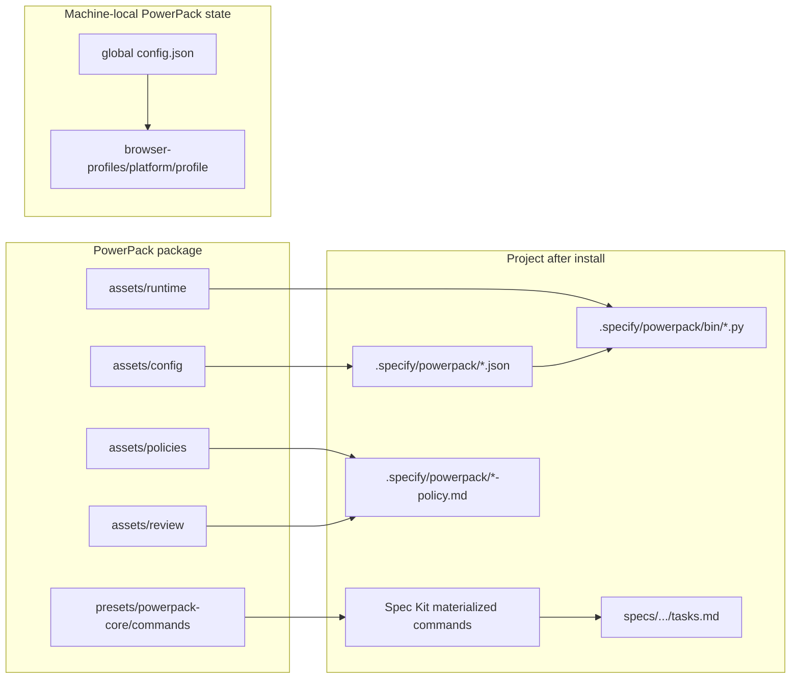
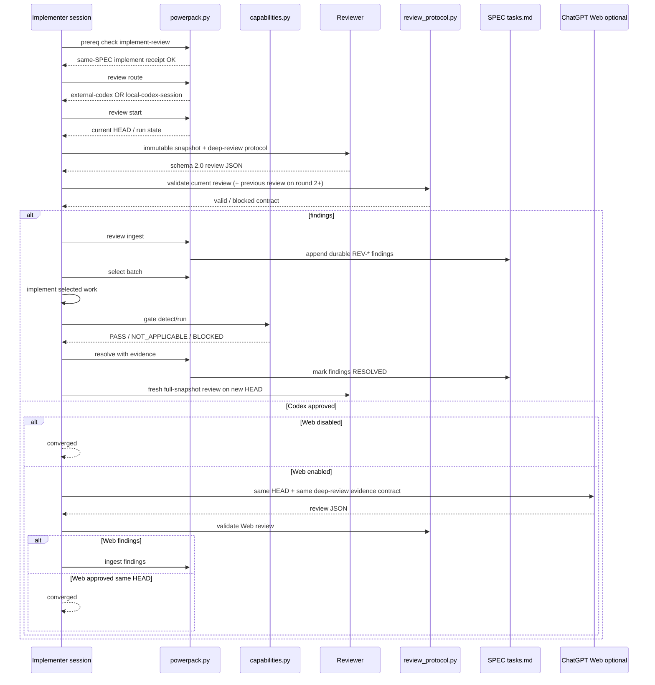
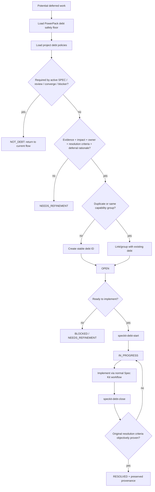
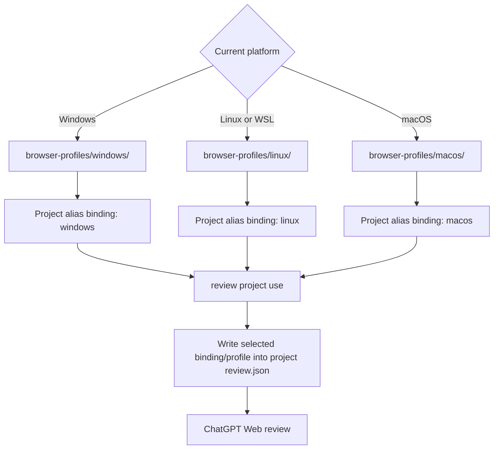
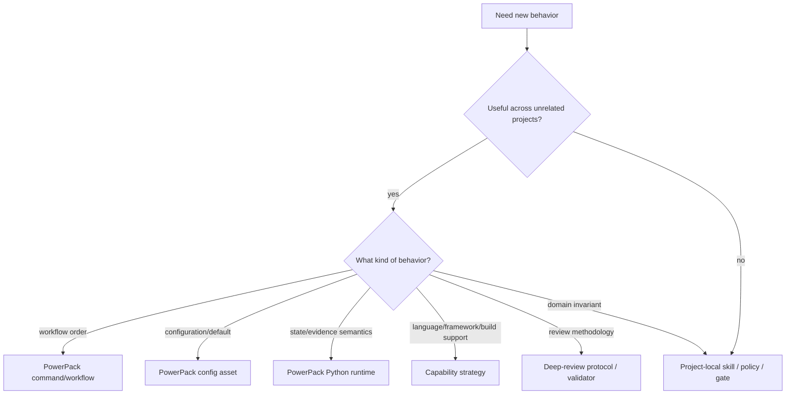

# PowerPack Process Architecture

This document maps the complete PowerPack delivery flow to the exact files that define each behavior and the supported customization surface for projects.

The design principle is:

```text
project intent/policy
      ↓
PowerPack orchestration
      ↓
capability resolution
      ↓
Spec Kit primitive / reviewer / gate
      ↓
auditable state + evidence
```

PowerPack workflows should stay agnostic to operating system, programming language, framework, IDE and build tool. Those differences are resolved behind capabilities/configuration rather than embedded into workflow branches.

## End-to-end process

```mermaid
flowchart TD
    U[User / project request] --> FC{Use full cycle?}

    FC -->|yes| FCFG[Load full-cycle policy]
    FCFG --> FR[Resolve exactly one SPEC]
    FC -->|no| DIRECT[Invoke an individual Spec Kit / PowerPack skill]

    FR --> CLARIFY[speckit-clarify]
    CLARIFY --> PLAN[speckit-plan]
    PLAN --> CHECK{Checklist applicable?}
    CHECK -->|yes| CK[speckit-checklist]
    CK --> CKR[Record same-SPEC checklist receipt]
    CKR --> CKC[speckit-checklist-converge]
    CHECK -->|no| TASKS[speckit-tasks]
    CKC --> TASKS
    TASKS --> ANALYZE[speckit-analyze]

    ANALYZE -->|blocking contradiction| SPEC_FIX[Fix SPEC / plan / tasks]
    SPEC_FIX --> ANALYZE
    ANALYZE -->|consistent| IMP[speckit-implement wrapper]

    IMP --> IB[Capture pre-implementation workspace snapshot]
    IB --> COREIMP[Official Spec Kit implement]
    COREIMP --> IE[Capture post-implementation delta]
    IE --> IR[Write same-SPEC implement receipt]

    IR --> CONV[speckit-converge]
    CONV --> CG{Remaining specified work?}
    CG -->|yes| CT[Append/retain convergence tasks]
    CT --> IMP
    CG -->|no| CLOSURE{Project closure gates?}

    CLOSURE -->|yes| PCG[Run project-defined closure evidence gates]
    PCG -->|fail| IMP
    CLOSURE -->|no| PREVIEW[Check implement-review predecessor]
    PCG -->|pass| PREVIEW

    PREVIEW --> ROUTE[Resolve reviewer route]
    ROUTE -->|Claude executor| EXT[Exactly one external codex exec]
    ROUTE -->|Codex executor| LOCAL[Current Codex session reviews locally]
    ROUTE -->|unknown| BLOCK[BLOCKED]

    EXT --> SNAP[Bind immutable review snapshot]
    LOCAL --> SNAP
    SNAP --> PROTO[Apply deep-review evidence protocol]
    PROTO --> P1[Pass 1: validate previous findings]
    P1 --> P2[Pass 2: re-review full snapshot against merge-base]
    P2 --> P3[Pass 3: adversarial verdict challenge]
    P3 --> VALIDATE[Validate schema/evidence contract]

    VALIDATE -->|invalid| BRV[BLOCKED_REVIEW_CONTRACT]
    VALIDATE -->|findings| LEDGER[Persist every finding in same-SPEC tasks.md]
    LEDGER --> SELECT{Interactive or auto batch?}
    SELECT -->|interactive| PICK[User selects pending IDs]
    SELECT -->|auto| ALL[Select all pending findings]
    PICK --> FIX[Implement selected review work]
    ALL --> FIX
    FIX --> QDISC[Discover quality-gate capability]
    QDISC --> QRUN[Run selected strategy]
    QRUN -->|fail/block| FIX
    QRUN -->|pass / N-A| RESOLVE[Resolve findings with evidence]
    RESOLVE --> OPEN{Open findings remain?}
    OPEN -->|yes| SELECT
    OPEN -->|no| REVIEW_AGAIN[Fresh independent review of new HEAD]
    REVIEW_AGAIN --> SNAP

    VALIDATE -->|APPROVED| WEB{ChatGPT Web gate configured?}
    WEB -->|no| DONE[DONE: current snapshot converged]
    WEB -->|yes| WPROF[Resolve platform-scoped browser profile + project binding]
    WPROF --> WREV[Independent ChatGPT Project deep review]
    WREV --> WVAL[Validate same review evidence contract]
    WVAL -->|findings| LEDGER
    WVAL -->|approved same HEAD| DONE

    DONE --> DEBT{Separate deferred work exists?}
    DEBT -->|no| END[Report completion]
    DEBT -->|yes| DCREATE[speckit-debt-create governance gate]
    DCREATE -->|not legitimately deferrable| CURRENT[Return work to current delivery flow]
    DCREATE -->|valid debt| DB[Record governed backlog item]
    DB --> END
```



## Diagram node map

| Diagram node / concern | Package source | Installed/project location | How projects customize it |
|---|---|---|---|
| `full-cycle policy` | `src/speckit_powerpack/assets/config/default-full-cycle.json` | `.specify/powerpack/full-cycle.json` | mode, enabled phases and round limits |
| `speckit-full-cycle` orchestration | `assets/presets/powerpack-core/commands/speckit.full-cycle.md` | materialized by Spec Kit preset | normally customize through `full-cycle.json`; change package source only for generic orchestration semantics |
| official `clarify/plan/checklist/tasks/analyze` | official GitHub Spec Kit | materialized Spec Kit commands | use project constitution/templates/policies; PowerPack should not fork them without a reusable reason |
| checklist predecessor receipt | `assets/runtime/powerpack_runtime.py` | `.specify/powerpack/bin/powerpack.py` + state files | `.specify/powerpack/prerequisites.json`; do not weaken same-SPEC invariant casually |
| `speckit-checklist-converge` | `assets/presets/powerpack-core/commands/speckit.checklist-converge.md` | materialized command | customize project checklists/policies, not OS/framework branches |
| `speckit-implement` wrapper | `assets/presets/powerpack-core/commands/speckit.implement.md` | materialized command | project tasks/spec drive implementation; runtime delta logic remains generic |
| pre/post workspace snapshot + receipt | `assets/runtime/powerpack_runtime.py` | `.specify/powerpack/bin/powerpack.py` | package-level only when generic state semantics change |
| `speckit-converge` | `assets/presets/powerpack-core/commands/speckit.converge.md` | materialized command | add project-local closure/traceability policy rather than hard-code project architecture into PowerPack |
| project closure gate | project-defined | project scripts/policies plus optional quality/closure configuration | project owns command and evidence semantics; should preferably be read-only |
| reviewer route | `assets/runtime/powerpack_runtime.py` + `default-model-routing.json` | `.specify/powerpack/bin/powerpack.py`, `.specify/powerpack/model-routing.json` | integration/model routing config; no recursive Codex spawn |
| deep review method | `assets/review/deep-review-protocol.md` | `.specify/powerpack/deep-review-protocol.md` | project may add stricter/domain probes, never weaken approval evidence |
| review output validation | `assets/runtime/powerpack_review_protocol.py` | `.specify/powerpack/bin/review_protocol.py` | package-level schema evolution; projects can add stricter checks around it |
| review mode/Web enablement | `assets/config/default-review.json` | `.specify/powerpack/review.json` | interactive/auto, project alias, Web enablement, reviewer profile |
| findings ledger / batch lifecycle | `assets/runtime/powerpack_runtime.py` | current SPEC `tasks.md` + `.specify/powerpack` state | lifecycle semantics are PowerPack invariant; user controls interactive batch selection |
| quality-gate discovery | `assets/runtime/powerpack_capabilities.py` | `.specify/powerpack/bin/capabilities.py` | extend capability strategies generically; projects use `custom_command` for unsupported/ambiguous architectures |
| gate override | generated default in `cli.py` | `.specify/powerpack/quality-gates.json` | set explicit argv `custom_command` |
| Web browser identity | `src/speckit_powerpack/cli.py` | global PowerPack config + platform-scoped profile directory | login/bind separately on Windows, Linux/WSL and macOS |
| Web project binding | `src/speckit_powerpack/cli.py` | global `config.json` binding per platform + project `review.json` selection | `review project bind/use/list`; same alias may have different bindings per platform |
| debt safety floor | `assets/policies/technical-debt.md` | `.specify/powerpack/technical-debt-policy.md` | projects may add stricter policy only |
| debt config | `assets/config/default-technical-debt.json` | `.specify/powerpack/technical-debt.json` | backlog path, ID prefix, project policy paths, extra stricter rules |
| debt lifecycle skills | `assets/presets/powerpack-core/commands/speckit.debt-*.md` | materialized commands | project-specific owners/domains/fields stay in project policy |

## Installed project view



The important separation is:

- **package source** defines reusable default behavior;
- **project-local `.specify/powerpack`** defines project configuration and installed runtime/policies;
- **SPEC `tasks.md`** holds durable review work;
- **global PowerPack state** holds machine/platform-specific browser identity and project bindings;
- generated agent skill files are materialized views, not the durable customization source.

## Review process in detail



### Where to alter review behavior

Use these locations in order of preference:

1. `.specify/powerpack/review.json` for mode/provider/Web settings;
2. `.specify/powerpack/model-routing.json` for active agent integration/model routing;
3. `.specify/powerpack/deep-review-protocol.md` for stricter project/domain probes;
4. `.specify/powerpack/quality-gates.json` for an explicit project gate;
5. package `speckit.implement-review.md` only when changing behavior that should be universal across projects;
6. package runtime/validator only when the state/evidence contract itself changes.

Do not edit a materialized `.claude/skills` or `.agents/skills` copy and expect it to survive rematerialization.

## Technical debt process in detail



### Where to alter debt behavior

- `.specify/powerpack/technical-debt.json`: backlog path, ID prefix and project policy documents;
- project policy documents: owners, domain boundaries, dependency directions, special fields/readiness requirements;
- `.specify/powerpack/technical-debt-policy.md`: installed PowerPack floor; projects should extend, not weaken it;
- package debt command files: only for reusable lifecycle changes.

A project that already has technical-debt governance should normally **reference it** from `project_policy_paths` rather than rewrite it into PowerPack.

## Browser profile and project-binding process



Even when all platforms use profile name `work`, their browser storage is distinct. WSL is treated as Linux and cannot accidentally reuse the Windows browser-profile directory.

## Full-cycle process customization

The default `full-cycle.json` can alter orchestration without editing the command:

```json
{
  "schema_version": 1,
  "mode": "interactive",
  "phases": {
    "clarify": true,
    "plan": true,
    "checklist": "when-applicable",
    "checklist_converge": true,
    "tasks": true,
    "analyze": true,
    "implement": true,
    "converge": true,
    "implement_review": true
  },
  "limits": {
    "max_convergence_rounds": 5,
    "max_review_rounds": 5
  }
}
```

Changing phase order or adding a universally useful phase belongs in the PowerPack command/workflow source. Adding a project-only check belongs in project policy/closure gates.

## Change decision guide



This decision tree is the main guard against turning PowerPack into a collection of assumptions from one project.
