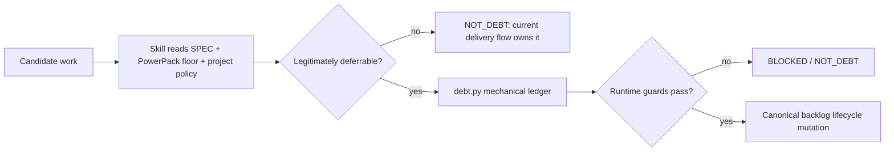

# Technical Debt Governance

PowerPack treats technical debt as a deliberate, auditable deferral of **non-blocking** engineering work. It is never an escape hatch for code review, convergence, correctness, security, data-integrity or acceptance-criteria failures.

## Policy precedence

The installed PowerPack floor is `.specify/powerpack/technical-debt-policy.md`. Projects may declare stricter rules through `.specify/powerpack/technical-debt.json -> project_policy_paths`, but project policy cannot weaken the PowerPack invariants.

When a project already has a debt-governance document, the debt skills read it before acting and combine it with the baseline. Project-specific owners, prefixes, domains, dependency directions and extra required fields remain local to the project.

## Semantic policy + mechanical runtime

Debt handling intentionally has two enforcement layers:



The agent/skill performs the semantic judgment that requires project context. The project-local runtime independently enforces deterministic rules and canonical storage.

Package runtime:

```text
src/speckit_powerpack/assets/runtime/powerpack_debt.py
```

Installed runtime:

```text
.specify/powerpack/bin/debt.py
```

## Creation gate

A new debt item may be created only when all of the following are true:

1. the work is not required to satisfy the active SPEC, acceptance criteria, constitution or mandatory quality gate;
2. it is not an unresolved finding from an active `speckit-implement-review` round;
3. it is not an actionable gap emitted by active `speckit-converge`;
4. it is not a P0/BLOCKER or an immediate correctness/security/compliance/data-integrity release blocker;
5. evidence shows the problem exists and its impact is understood;
6. there is a concrete reason to defer it now;
7. there is an objective resolution criterion;
8. ownership is explicit;
9. duplicates and closely related items have been checked first.

If any of items 1–4 fail, the work belongs to the current delivery flow and MUST be fixed there instead of becoming debt.

The runtime additionally rejects P0/BLOCKER creation, an explicit `--active-obligation`, and `origin-kind=review|converge` under the default floor. A skill must never disguise one of those origins as `manual` to bypass the guard.

## Required fields

Every item records at least stable ID, owner, description, origin/provenance, impact, priority, status, readiness, objective resolution criteria, deferral rationale, dependencies/blockers when known, probable future SPEC/capability when known, lifecycle history and evidence.

`P0` is intentionally absent from default backlog priorities: a blocker is handled in the flow that discovered it.

## Lifecycle

```text
OPEN -> IN_PROGRESS -> RESOLVED
```

Readiness is independent:

```text
READY | BLOCKED | NEEDS_REFINEMENT | RESOLVED
```

Operational commands are deterministic:

```bash
python .specify/powerpack/bin/debt.py list
python .specify/powerpack/bin/debt.py consult TD-001
python .specify/powerpack/bin/debt.py start TD-001 --spec specs/...
python .specify/powerpack/bin/debt.py close TD-001 --criteria-satisfied --evidence "..."
```

Starting debt does not automatically create a SPEC. Multiple related items should be grouped into a coherent capability when that produces a better implementation unit. IDs are stable, never reused or renumbered. Historical description and provenance are preserved across lifecycle updates.

## Closing policy

`RESOLVED` requires objective evidence against the original resolution criteria. A PR number, commit SHA or agent statement alone is provenance, not proof.

When code validation is required, use the PowerPack capability-selected quality gate rather than a language/framework-specific command embedded in the debt skill. Residual work prevents full closure.

The runtime requires both an explicit `--criteria-satisfied` assertion from the semantic gate and non-empty evidence before it mutates status/readiness to `RESOLVED`. This assertion is not itself proof; the skill must have already evaluated the objective evidence and stricter project policy.

## Storage and template

Default configuration:

```json
{
  "storage_format": "markdown-v1",
  "backlog_path": "docs/technical-debt.md",
  "template_path": ".specify/powerpack/technical-debt-template.md",
  "id_prefix": "TD",
  "project_policy_paths": []
}
```

When the default Markdown backlog does not exist, `debt.py create` copies the canonical installed template before appending the first item. It allocates stable sequential IDs and performs deterministic exact-title normalization/deduplication.

Projects with an established format may point `backlog_path` at their existing backlog and add governance documents to `project_policy_paths`. If a non-default storage format has no deterministic project adapter/contract, runtime creation returns `BLOCKED_CONFIGURATION` rather than guessing how to write it.

## Skills

- `speckit-debt-create` — semantic deferral gate + deterministic creation.
- `speckit-debt-list` — read-only inventory/filter/readiness view.
- `speckit-debt-consult` — exact item, provenance, evidence, relationships and governance conflicts.
- `speckit-debt-start` — readiness gate and `OPEN -> IN_PROGRESS` transition.
- `speckit-debt-close` — objective evidence gate + `RESOLVED` lifecycle mutation.

For customization examples see [`CUSTOMIZATION.md`](CUSTOMIZATION.md); for the lifecycle/process map see [`PROCESS_ARCHITECTURE.md`](PROCESS_ARCHITECTURE.md).
