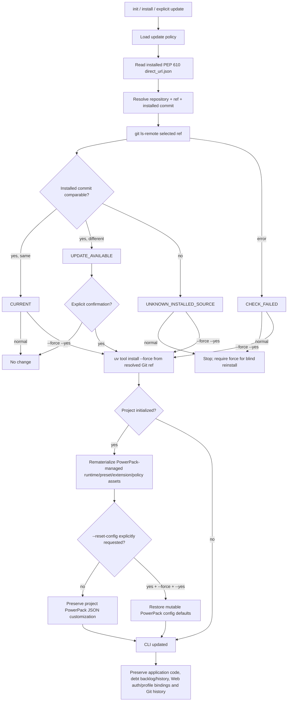

# PowerPack Update and Recovery

PowerPack has two separately controlled update surfaces:

1. **installed CLI/package** — the `speckit-powerpack` executable managed by `uv`;
2. **project materialization** — PowerPack runtime, preset, extension, policies and default configs under an initialized Spec Kit repository.

The updater never authorizes destructive Git operations.

## Detailed update process



## Diagram node map / customization surface

| Diagram node | Package implementation | Installed/project state | How to customize |
|---|---|---|---|
| `Load update policy` | `src/speckit_powerpack/assets/config/default-update.json` | `.specify/powerpack/update.json` | enable/disable checks, auto-check-on-install, repository/ref overrides and refresh policy |
| `Read installed metadata` | `src/speckit_powerpack/update_manager.py::installed_vcs_info` | Python distribution `direct_url.json` | do not hand-edit; choose install source/ref instead |
| `Resolve repository/ref` | `update_manager.py::effective_source` | packaged default + installed `requested_revision` + project update config | set `repository`/`ref` in `update.json` or explicit CLI flags |
| `git ls-remote` | `update_manager.py::remote_sha` | no durable project mutation | change package code only for a universally different source resolver |
| update decision | `update_manager.py::check_update` | none | package-level semantic change only |
| explicit confirmation | `src/speckit_powerpack/cli.py` | terminal/user interaction | `--yes`/`--yes-update` only when operator explicitly pre-authorizes automation |
| CLI reinstall | `update_manager.py::apply_self_update` | `uv` managed tool environment | source/ref configurable; force remains explicit |
| project rematerialization | `cli.py::install_support` + `install_components` | `.specify/powerpack/*` + Spec Kit preset/extension materialization | project config preserved by default |
| config reset | `cli.py` forced project refresh | PowerPack JSON files under `.specify/powerpack` | requires explicit `--force --reset-config --yes` recovery request |
| agent update command | `assets/extensions/powerpack-tools/commands/update.md` | materialized agent command | extend project instructions, but never weaken explicit confirmation for force/reset |

## Source identity

When installed from Git through `uv`/pip-compatible tooling, PowerPack reads PEP 610 `direct_url.json` metadata and compares the installed `commit_id` with the selected remote Git ref using `git ls-remote`.

A development install that records `requested_revision=feat/example` follows `feat/example` by default. This prevents a feature-branch installation from accidentally treating an older `main` as an update.

If the installed commit cannot be proven, normal automatic update stops with `UNKNOWN_INSTALLED_SOURCE`. A blind reinstall then requires explicit `--force`.

## Installer-triggered update

`init` and `install` consult `.specify/powerpack/update.json` when available, otherwise packaged defaults:

```json
{
  "enabled": true,
  "auto_check_on_install": true,
  "confirmation_required": true
}
```

When a newer commit is detected the installer displays installed/remote identity and asks before updating. In non-interactive automation, confirmation must be explicit with `--yes-update`.

Disable one check with:

```bash
speckit-powerpack install . --no-update-check
```

The internal restart after a successful self-update sets a one-shot skip marker so the new CLI does not recursively check/update again.

## Manual check

```bash
speckit-powerpack update . --check
```

Possible statuses include `CURRENT`, `UPDATE_AVAILABLE`, `UNKNOWN_INSTALLED_SOURCE` and `CHECK_FAILED`. A check never modifies the CLI or repository.

## Normal confirmed update

```bash
speckit-powerpack update .
```

or non-interactively after the operator has already approved:

```bash
speckit-powerpack update . --yes
```

Normal update updates the CLI through `uv`, rematerializes PowerPack-managed assets and preserves project-customized PowerPack JSON, debt backlog/history, source/application files and platform-scoped Web authentication/project bindings.

## Forced recovery

When source comparison is unavailable or managed files are corrupted:

```bash
speckit-powerpack update . --force --yes
```

This is intentionally "brute" only inside the PowerPack ownership boundary. It reinstalls the CLI and overwrites packaged/runtime/preset/extension/policy assets that PowerPack owns. It does **not** run `git reset`, rebase, force-push, delete project code, delete debt history or delete browser profiles.

If only project materialization is broken, prefer:

```bash
speckit-powerpack update . --project-only --force --yes
```

## Resetting PowerPack configuration

Restoring mutable PowerPack project config to package defaults is a stronger and separate recovery action:

```bash
speckit-powerpack update . --project-only --force --reset-config --yes
```

This may reset custom values in `model-routing.json`, `review.json`, `technical-debt.json`, `full-cycle.json`, `update.json`, `prerequisites.json` and `quality-gates.json`. It still does not delete the debt backlog or global Web authentication data. Agents MUST never add `--reset-config` without an explicit user request.

## Agent command

The `powerpack-tools` extension exposes `speckit.powerpack-tools.update`. The agent checks first, explains source/ref/scope and obtains confirmation. `--force` and especially `--reset-config` are never inferred.

## Customization rule

Use `.specify/powerpack/update.json` for project policy and explicit CLI flags for one-off source/ref recovery. Change `update_manager.py` or updater semantics only when the behavior is reusable across unrelated projects.
